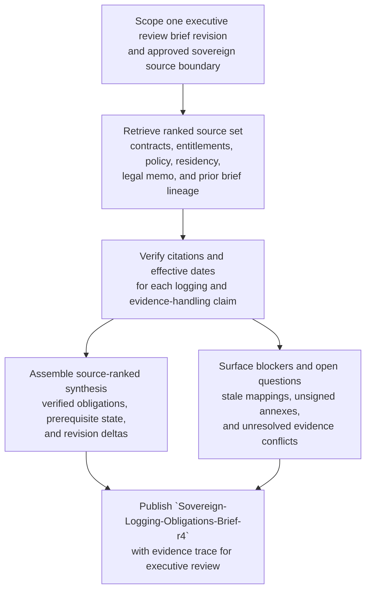
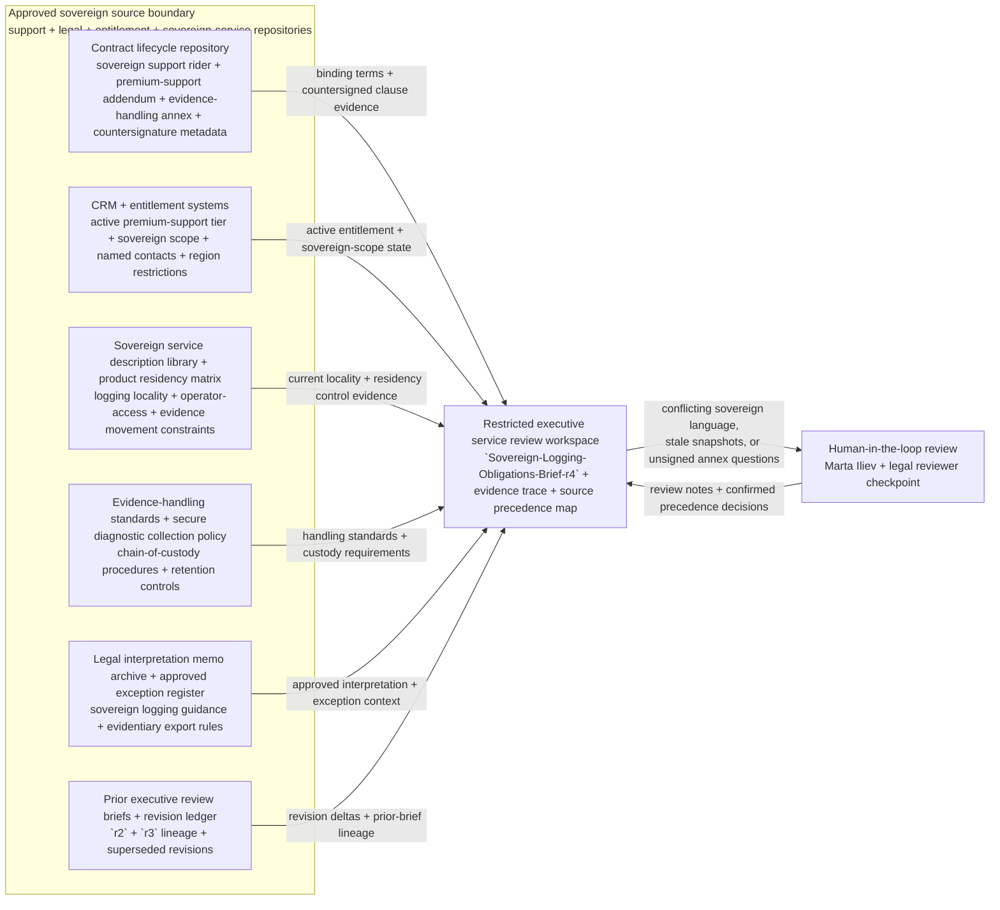

# Premium support sovereign logging and evidence-handling obligations synthesis for executive service review

## Linked pattern(s)

- `research-synthesis-with-citation-verification`

## Domain

Support.

## Scenario summary

A premium-support executive service review is being prepared for a sovereign-cloud customer that requires contractually constrained logging, diagnostic evidence retention, and region-locked handling for support artifacts tied to severe incidents. Before anyone promises expanded log access, approves a handling exception, reassures the customer, or changes the live evidence path, the workflow needs one exact governed synthesis brief revision, `Sovereign-Logging-Obligations-Brief-r4`, that states which logging and evidence-handling obligations are actually in force across the signed sovereign support rider, premium-support addendum, evidence-handling annex, current sovereign service description, approved legal interpretation memo, product residency matrix, and active entitlement records. The brief must show explicit source precedence, confirm prerequisite state such as current countersigned terms and frozen source snapshots, highlight visible blockers such as stale residency mappings or unsigned annex references, preserve revision lineage from `r2` and `r3`, and leave one named owner, Marta Iliev, Director of Sovereign Support Governance, accountable for synthesis quality only rather than downstream recommendation, approval, customer communication, or execution.

## Target systems / source systems

- Restricted executive service review workspace where the revisioned brief, evidence trace, and superseded prior revisions are stored
- Contract lifecycle repository containing the sovereign support rider, premium-support addendum, evidence-handling annex, renewal record, and countersignature metadata
- CRM and entitlement systems showing the active premium-support tier, sovereign service scope, named contacts, and region-specific support restrictions
- Sovereign service description library and product residency matrix for current logging locality, operator-access, and support evidence movement constraints
- Support evidence-handling standard, chain-of-custody procedure set, and approved secure diagnostic collection policy
- Legal interpretation memo archive and approved exception register for prior guidance on sovereign logging access, evidentiary exports, and regulator-sensitive handling
- Prior executive service review briefs and revision ledger used to compare `r4` against `r2` and `r3`

## Why this instance matters

This grounds the pattern in a premium-support workflow where the key deliverable is a citation-verified obligations brief for executives, not a service recommendation or an operational response. Sovereign support reviews often blend executed contract terms, service-specific residency controls, evidence-handling standards, and interpretation memos that do not carry equal authority. The instance shows why source trust boundaries, claim-level citation checks, visible blockers, and revision lineage must stay explicit before leadership relies on the brief during a high-sensitivity service review.

## Likely architecture choices

- A tool-using single agent can retrieve the approved sovereign source set, extract obligation claims, verify citations, and assemble a bounded synthesis with claim-to-source mappings.
- Human-in-the-loop review should remain mandatory for source-boundary confirmation, interpretation of conflicting sovereign handling language, and any downstream use in executive or customer-facing settings.
- The workflow should preserve a structured evidence trace that distinguishes binding executed terms, current policy and service-description controls, approved legal interpretation, and lower-authority operational context.
- Retrieval should stay inside approved support, legal, entitlement, and sovereign-service repositories; unsupported inference about concessions, exception approval, or live evidence movement should be blocked.

## Governance notes

- Executed sovereign rider terms and countersigned evidence-handling annex clauses should outrank CRM notes, bridge summaries, chat excerpts, or copied case commentary when sources disagree.
- Citation verification should confirm document identity, effective date, revision currency, and clause-to-claim alignment before a logging or evidence-handling statement appears in the brief.
- Prerequisite state should remain explicit, including active entitlement status, current sovereign service-description version, validated residency matrix snapshot, and confirmed access to the approved legal memo set.
- Visible blockers should remain in the brief instead of being flattened away, especially unsigned annex references, stale residency mappings, unresolved retention-window conflicts, or missing chain-of-custody evidence.
- Revision lineage should show what changed from `r2` to `r3` to `r4` so executive reviewers can distinguish newly verified obligations from carry-forward assumptions or newly opened questions.
- Marta Iliev, Director of Sovereign Support Governance, is accountable for synthesis quality, citation integrity, and blocker visibility only, not for downstream recommendation, approval, customer communication, or execution.

## Evaluation considerations

- Percentage of material logging-locality, evidence-retention, chain-of-custody, and operator-access claims backed by inspectable citations to the current approved sovereign source set
- Reviewer correction rate for source precedence, effective-date handling, or citation mismatch during executive service review
- Rate at which stale source snapshots, unsigned annexes, or contradictory sovereign-handling terms are surfaced explicitly before the brief is used downstream
- Usefulness of the open-questions and blocker sections for helping support leadership and legal reviewers resolve gaps without reconstructing the full source corpus
