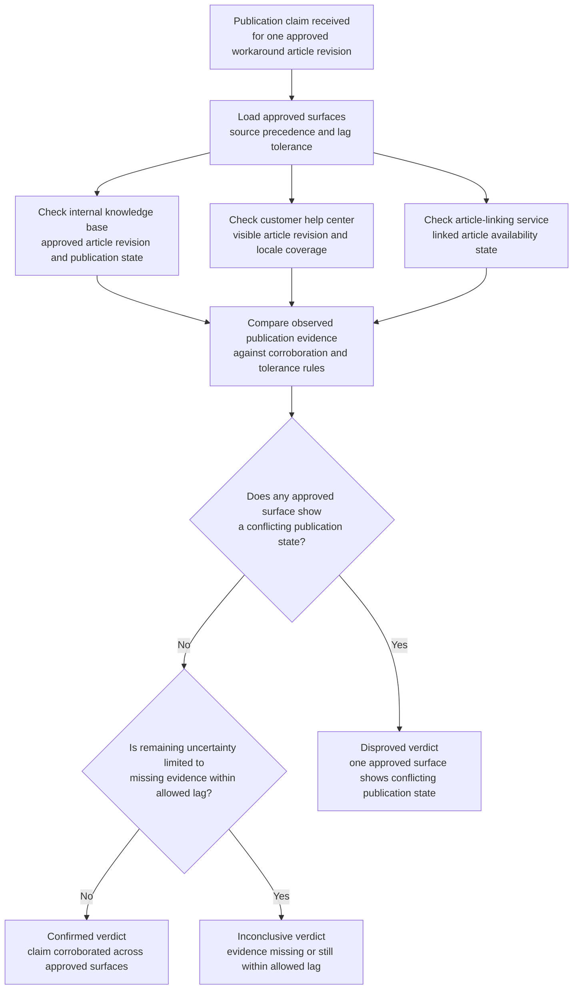
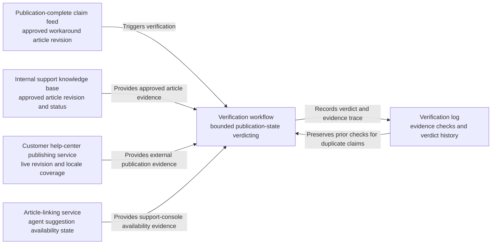

# Premium support workaround article publication verification

## Linked pattern(s)

- `claimed-state-verification`

## Domain

Support.

## Scenario summary

Knowledge operations marks a premium-support workaround article as published after the internal knowledge base, customer help center, and article-linking service report successful release for a high-volume but low-stakes product issue. Case teams still need to know whether the claimed publication state is actually true on the approved support surfaces before they cite the article in routine customer responses. The workflow verifies the claim against authoritative evidence and emits a bounded verdict; it must not send customer communications, reclassify the issue, or publish corrective updates itself.

## Target systems / source systems

- Internal support knowledge base that records the approved article version and publication status
- Customer help-center publishing service showing the externally visible article revision and locale coverage
- Article-linking or suggestion service used inside the support console to surface the workaround to agents
- Knowledge-operations workflow tracker or event stream that records the publication-complete claim
- Audit or verification log preserving evidence checks, verdicts, lag handling, and follow-up records

## Why this instance matters

This grounds the pattern in support work where a publication-complete claim can look trustworthy while one support surface still serves a stale revision or the agent suggestion layer has not yet caught up. The workflow remains low risk because it only confirms whether the article is actually available where teams expect it, and it stops before any customer-facing communication, issue escalation, or content repair. That makes it a clean evidence-backed verification example rather than briefing, triage, or execution.

## Likely architecture choices

- Event-driven monitoring fits because the verification run begins from the recorded publication-complete claim and immediately checks the approved support surfaces.
- A tool-using single agent can compare article ids and revisions across the internal KB, customer help center, and suggestion service while applying approved cache and indexing tolerances.
- Bounded delegation is appropriate because support owners can predefine the required evidence sources and acceptable lag, while humans retain control over any republish, customer notification, or escalation.
- Durable verification state should capture duplicate publication events and delayed indexing so agents are not shown conflicting verdicts about the same article.

## Governance notes

- Only the approved knowledge systems should count as authoritative evidence; screenshots, copied article text, or chat claims should not confirm the article's live status.
- Verification records should minimize customer issue detail and focus on article identifiers, publication versions, locale coverage, and observed surface states.
- If the help center and support-console suggestion layer disagree within an allowed indexing window, the verdict should remain explicitly inconclusive rather than optimistic.
- Republishing the article, updating the workaround text, or instructing agents to send customer messages remains outside the workflow and under human ownership.

## Evaluation considerations

- Percentage of workaround-article publication claims that receive a verdict with complete surface and version traceability
- Rate at which stale or partial article publication states are detected before agents rely on the workaround content
- Reviewer agreement that the verification workflow used the correct cache, locale, and indexing tolerances
- Clarity of follow-up records when one support surface remains stale beyond the approved publication window
