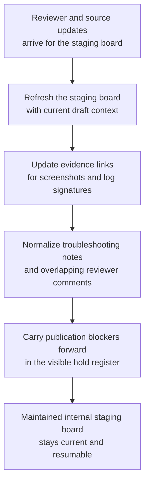

# Premium support workaround article staging board shared workbench upkeep

## Linked pattern(s)

- `shared-workbench-orchestration`

## Domain

Support.

## Scenario summary

A premium support knowledge team keeps an internal workaround-article staging board while product specialists, support leads, and documentation reviewers refine a draft troubleshooting article for a known enterprise issue. Small updates arrive continuously: one engineer revises a prerequisite step, a support lead adds a customer-safe caution note, a reviewer flags a stale screenshot, and the product owner links a newly confirmed log signature. The agent maintains the shared staging board by refreshing linked evidence, normalizing step formatting, deduplicating overlapping reviewer comments, updating section owners, and carrying publication blockers forward in a visible hold register. Humans remain responsible for deciding whether the workaround is actually supported, what wording is safe for customer-facing publication, and when the staged article should enter a separate publication or communication workflow.

## Target systems / source systems

- Shared article-staging board with draft sections, ownership fields, blocker tags, and revision history
- Internal knowledge-base staging workspace containing the current workaround draft and linked source references
- Product issue tracker or bug record with confirmed symptoms, affected versions, and engineering notes
- Screenshot or diagnostic artifact store referenced by step-level reviewer comments
- Documentation review or annotation surface where support and product reviewers add small edits, cautions, and hold notes

## Why this instance matters

This scenario is collaborative, but it stays low-risk because the maintained artifact is still an internal staging board rather than a published article or customer communication. The hard part is keeping the workbench coherent as many low-level edits arrive without letting the agent quietly promote provisional notes into publication-ready guidance. That makes it a clean grounding for shared-workbench upkeep instead of broader drafting or approval-centered collaboration.

## Likely architecture choices

- Event-driven monitoring fits because upkeep should react whenever article comments, linked issue state, or staging-board fields change.
- A tool-using single agent can refresh screenshots, normalize troubleshooting-step structure, and keep blocker labels current in one bounded workbench.
- Human-in-the-loop review is required when wording could become customer-facing advice, when a caveat changes support posture, or when the board suggests a workaround is fully validated.
- Bounded delegation works because the team can predefine which formatting and linkage updates may be applied automatically and which publication-adjacent edits must stay on hold.

## Governance notes

- The board should clearly separate confirmed internal troubleshooting steps, reviewer proposals, and publication blockers so the upkeep loop never implies that internal staging content is ready for customers.
- Screenshot references, issue ids, and version notes should be refreshed from authoritative internal sources before a section is marked current.
- The agent may improve structure and merge duplicate comments, but it should not decide whether a workaround is externally supportable or remove a caution that a human reviewer accepted.
- If a requested update would publish the article, send guidance to customers, or change product-support posture, the workflow should stop and hand off rather than treating it as routine workbench maintenance.

## Evaluation considerations

- Percentage of staging-board updates that preserve correct issue links, blocker tags, and section ownership across repeated refresh cycles
- Reviewer correction rate for automatically maintained troubleshooting steps, merged comment threads, or refreshed screenshot references
- Rate at which publication-adjacent wording is held for human review instead of being silently treated as routine upkeep
- Usefulness of the maintained board for helping support and documentation reviewers resume work without reconstructing stale context
