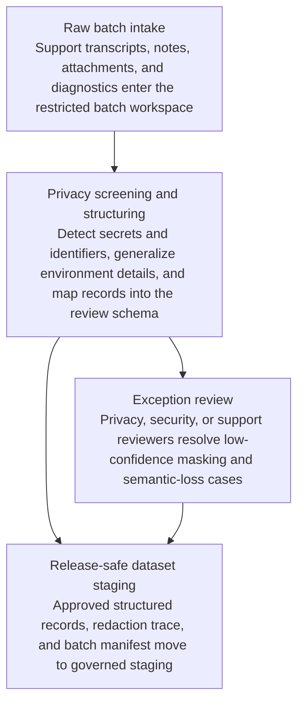

# Privacy-screened support transcript batch to quality-review dataset

## Linked pattern(s)

- `batch-content-transformation`

## Domain

Support.

## Scenario summary

A premium support operations team is preparing a monthly quality and coaching review for a set of escalated enterprise incidents. The raw batch includes chat transcripts, bridge summaries, ticket comments, uploaded log snippets, screenshots, customer-provided configuration notes, and agent wrap-up narratives that can contain customer names, user email addresses, API keys, tenant ids, internal hostnames, and detailed descriptions of production architecture. Before any quality-review session, coaching calibration, or cross-team trend analysis can occur, the workflow must transform that batch into a privacy-screened structured dataset with case pseudonyms, normalized issue and product tags, response-step markers, escalation-stage fields, customer-impact buckets, secret-detection flags, and restricted-boundary evidence links while removing or generalizing customer identifiers, credentials, and environment details from the release-safe package.

## Target systems / source systems

- Support ticketing and transcript repositories holding chats, bridge notes, attachments, and incident summaries
- Privacy and secret-detection tooling for credentials, tenant identifiers, email addresses, network details, and customer-specific infrastructure references
- Quality-review schema registry defining the structured coaching dataset, approved issue taxonomy, and audience-specific release constraints
- Review workbench and governed staging store for transformed support records, redaction trace, and batch approval manifest
- Exception queue for support leadership, privacy, or security review before the dataset is shared outside the restricted incident workspace

## Why this instance matters

This grounds the transform pattern in a support workflow where the value comes from a reusable, structured quality-review dataset rather than automated incident response, severity adjudication, or customer communication. Support artifacts are rich in operational detail, and simple name masking is rarely sufficient because credentials, hostnames, tenant topology, and product-specific clues can still expose a customer or its environment. The instance shows why governed batch transformation, explicit secret handling, and human approval are necessary when teams want to learn from incidents without broadening access to the raw customer record.

## Likely architecture choices

- An orchestrated multi-agent workflow can separate transcript parsing, secret and identifier detection, policy-constrained redaction, and structured quality-tag packaging while preserving clear audit boundaries.
- Human reviewers should stay in the normal loop to resolve borderline environment references, judge whether a generalized excerpt still reveals a customer, and approve the release-safe manifest for quality-review use.
- The workflow should stop at an internal quality-review dataset and reviewed manifest rather than creating customer-facing summaries, triggering engineering work, or updating incident status in live systems.
- Approved rules may normalize product names, issue categories, and response stages into controlled taxonomies, but unsupported inference about root cause, customer contract priority, or remediation quality should remain out of scope.

## Governance notes

- Every structured field should retain lineage to the original transcript span, ticket comment, or attachment segment inside the restricted support workspace so authorized reviewers can re-check contested masking decisions.
- The workflow should route exceptions when attachments contain unclear secrets, screenshots still reveal identifying UI elements, or combinations of timestamps, tenant hints, and environment details could expose a specific customer.
- Lossy transformations, such as compressing detailed troubleshooting sequences into short response-stage codes or high-level issue categories, should be visible in the trace and manifest instead of hidden behind a polished dataset.
- Support leadership, privacy, or security reviewers must approve whether the transformed batch is safe for coaching or trend analysis; the workflow stops before any downstream operational action or external sharing.

## Evaluation considerations

- Percentage of transformed support records accepted for quality review without reopening raw transcripts or attachments
- Rate of residual secret, tenant, or customer-identifying findings discovered during reviewer sampling after approval
- Completeness of lineage and masking evidence for issue tags, impact buckets, and coaching-relevant response-step fields
- Reliability of the handoff when log snippets are malformed, screenshots include hidden metadata, or new secret patterns appear in customer-provided diagnostics
