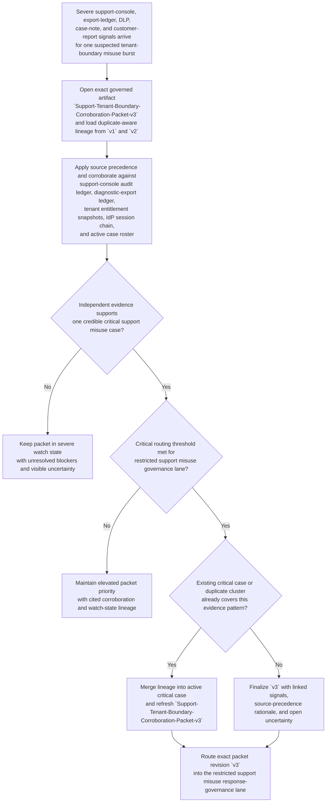

# Privileged support diagnostic export tenant-boundary critical corroboration triage

## Linked pattern(s)

- `critical-signal-corroboration-triage`

## Domain

Support.

## Scenario summary

A support trust workflow watches for a severe cluster that may indicate privileged support misuse across tenant boundaries before any formal response lane is opened: support-console impersonation sessions touching two unrelated regulated tenants from one operator identity, restricted diagnostic-export staging requests that do not match the active case roster, data-loss-prevention near-miss alerts on copied case artifacts, emergency note-redaction events on the same cases, and customer-reported admin-activity timestamps that overlap the support access window. The workflow must determine whether those independent signals corroborate one credible critical case, merge duplicate alerts and prior watch-state lineage into the exact governed artifact `Support-Tenant-Boundary-Corroboration-Packet-v3`, preserve explicit uncertainty, and route only that packet revision into the restricted support misuse response-governance lane. It stops before deciding whether the activity was malicious, suspending support access, opening a collaboration room, notifying customers, assigning investigators, or executing containment.

**Prerequisite state before `Support-Tenant-Boundary-Corroboration-Packet-v3` can be advanced:**
- The packet lineage from `v1` and `v2` is available, including duplicate-cluster identifiers for previously merged support-console, DLP, and customer-reported signals.
- The evidence window for the suspected misuse burst is frozen to the cited support-session interval so later unrelated case activity does not silently expand scope.
- The current support-role roster, tenant-entitlement snapshot, and active restricted-case roster are captured for the same review window.
- The secure diagnostic-export ledger and support-console audit stream have completed their latest ingest for the packet window, even if some referenced artifacts remain delayed.

## Target systems / source systems

**Authoritative (highest precedence):**
- Support-console audit ledger recording impersonation starts and ends, tenant-context switches, sensitive screen and object access, operator identity, and privileged action references.
- Secure diagnostic-export ledger showing bundle staging, attachment retrieval, export-scope identifiers, policy gates, and whether each export request matched an active support case and approved tenant boundary.
- Tenant-entitlement and restricted-case roster snapshots capturing which support engineers, accounts, and escalation cases were authorized for the implicated tenants during the packet window.
- Identity-provider session chain and workstation-attestation records tying the operator identity, step-up events, device posture, and support-console session continuity together.

**Operational and contextual (secondary precedence):**
- Data-loss-prevention near-miss alerts, case-note redaction events, and support workflow telemetry showing when sensitive artifacts were copied, masked, or reclassified around the same session window.
- Customer-reported admin-activity timestamps, trust-desk complaints, and escalation summaries that may corroborate impact timing but do not outrank platform audit records.
- Prior duplicate clusters and open watch-state packets that show whether the current burst extends an already-visible misuse pattern or represents a distinct critical case.

**Excluded from authoritative use without explicit promotion:**
- Informal reviewer chat, screenshots, or recollections that are not linked to the support-console audit ledger, export ledger, or captured roster snapshot.
- Post-window access-control changes, operator lockouts, or later remediation tickets created after the frozen corroboration interval.
- Draft customer-impact estimates or downstream investigation notes that were produced after `Support-Tenant-Boundary-Corroboration-Packet-v3` entered triage.

## Why this instance matters

This grounds `critical-signal-corroboration-triage` in support through a severe pre-response scenario where the hard problem is not approving a handoff or co-authoring an investigation artifact, but deciding whether several independently serious support-side indicators point to one credible critical tenant-boundary misuse case. The instance is materially distinct from the repository's support alert-triage and dispatch examples because it centers an exact corroboration packet revision, explicit source precedence across privileged support systems, duplicate-aware lineage, and a hard stop at routing into one restricted governance lane. It also keeps support-specific governance visible: customer complaints and case-note anomalies matter, but they cannot silently override the authoritative support-console and export records that determine whether the workflow should elevate uncertainty into critical human review.

## Likely architecture choices

- Event-driven monitoring fits because support-console activity, export staging, DLP near-misses, note-redaction events, and customer reports arrive asynchronously and can materially change corroboration within minutes.
- An orchestrated multi-agent or staged-service design fits because audit retrieval, roster and entitlement verification, duplicate-lineage maintenance, and packet assembly are specialized steps that must converge on one shared critical-case state.
- Human-in-the-loop review remains mandatory because routing `Support-Tenant-Boundary-Corroboration-Packet-v3` into the restricted misuse lane can rapidly influence downstream access-control, privacy, and product-security decisions even though this workflow itself does not take those actions.

## Governance notes

- `Support-Tenant-Boundary-Corroboration-Packet-v3` should show exact source precedence, making clear that support-console and export-ledger evidence outrank DLP summaries, customer complaints, and analyst interpretations.
- Duplicate handling must preserve lineage across operator identities, tenant pairs, export identifiers, support-case ids, and prior watch-state packets so reviewers can distinguish one expanding misuse cluster from overlapping but unrelated support anomalies.
- Visible blockers should remain explicit in the packet, such as a stale sovereign-tenant entitlement snapshot, an unresolved operator-handoff alias, delayed DLP replay evidence, or a missing remote-assist screen-record checksum.
- Broad queue views should minimize tenant names, operator identities, export filenames, and restricted artifact descriptors while preserving access-controlled references back to the authoritative ledgers.
- The workflow must end at corroborated triage, severity framing, packet revision, and governed routing into the restricted support misuse lane rather than implying maliciousness findings, investigator assignment, customer communication, access suspension, or live containment.

## Evaluation considerations

- Recall of historically valid privileged-support misuse or tenant-boundary exposure clusters that should have produced a routed critical corroboration packet
- Median time from the first severe cross-signal burst to a reviewer-ready `Support-Tenant-Boundary-Corroboration-Packet-v3`
- Accuracy of duplicate merging and lineage preservation when export, impersonation, DLP, and customer-reported signals only partially overlap across multiple support cases
- Reviewer agreement that the packet distinguishes genuine multi-source corroboration from coincidental co-occurrence in noisy support and trust telemetry
- Reliability of uncertainty escalation when one authoritative source lags, such as strong console and export evidence with delayed DLP replay or incomplete entitlement refresh
