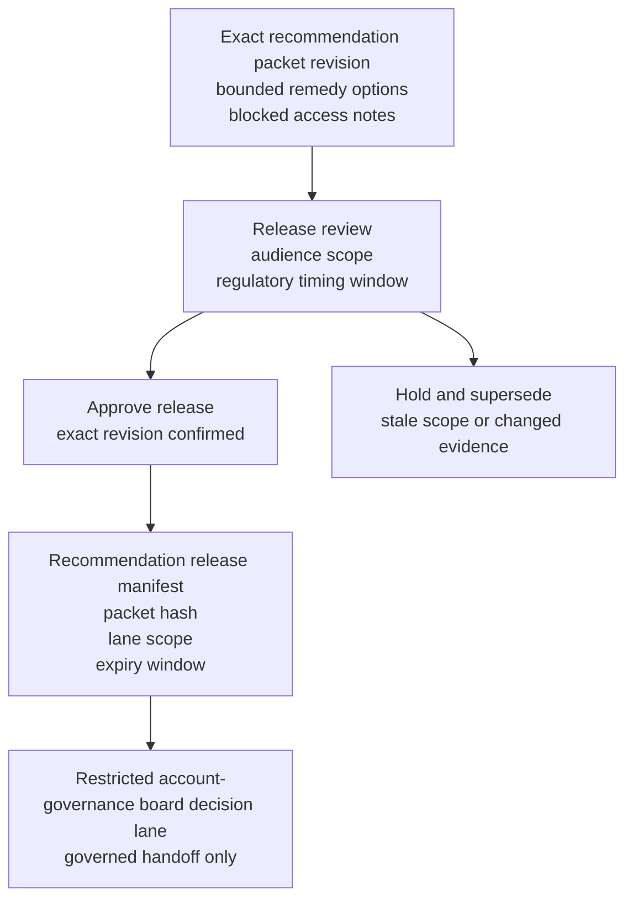

# Regulated customer audit-export remedy recommendation packet revision approved for restricted account-governance board decision lane

## Linked pattern(s)

- `approval-gated-recommendation-release`

## Domain

Support.

## Scenario summary

An enterprise support workflow has already prepared one exact recommendation packet revision for a regulated customer's audit-export remedy package after repeated compliance-archive extraction failures blocked a time-bound external submission. The packet narrows the bounded options to release one supervised reconstruct-and-validate export package with time-boxed vendor assistance, release a narrower partial-export and evidence-gap disclosure package tied to validated retained records, or escalate to chief privacy and legal review, and it keeps blocked requests such as an unrestricted database dump, continuous raw-log streaming, or open-ended manual analyst augmentation explicit. Before that exact packet revision can enter the restricted account-governance board decision lane, a named support release owner must approve the audience scope, regulatory timing window, and release manifest so reviewers receive the governed recommendation artifact rather than a stale or over-shared copy. The workflow stops at governed release of that packet revision; it does not decide which remedy package is granted, execute the export, amend data-sharing terms, or communicate the outcome to the customer.

## Target systems / source systems

- Audit-export remedy recommendation workspace holding the current packet revision, bounded remedy options, blocked-access notes, and superseded drafts
- Support case, archive-job history, retention-policy, privacy-review, contractual entitlement, and prior exception records already cited by the recommendation packet
- Governance repository defining the named restricted account-governance board lane, authorized recipients, regulatory timing window, and the human owner who may approve packet release
- Approval manifest and routing tooling that records the exact packet hash, lane scope, and any blocked forwarding attempts outside the approved governance audience
- Audit and supersession ledger used to hold older packet revisions when retention evidence, export feasibility, or requested data-access scope changes before board review

## Why this instance matters

This grounds the pattern in support where the reusable challenge is release control over a sensitive customer-remedy recommendation artifact, not export troubleshooting or customer communication execution. Audit-export remedy packets can change late when retention validation hardens, privacy reviewers narrow permissible evidence scope, or contractual export rights are clarified, so approval must bind to one reviewed recommendation revision and one restricted account-governance board lane instead of to a general permission to circulate data-access advice. The example keeps the family boundary explicit by ending at packet release for human review rather than board adjudication, archive reconstruction work, contract amendment, or customer-facing follow-through.

## Likely architecture choices

- Approval-gated execution fits because the recommendation packet remains blocked until a named support owner authorizes release into the restricted account-governance board decision lane.
- Human-in-the-loop review remains necessary because only accountable support and data-governance owners should confirm audience scope, expiry, and blocked-access visibility without turning the release into approval of the remedy itself.
- A governed agent can verify packet hashes, assemble the manifest, and block broadened distribution, but it should not execute the export, approve exceptional data access, or send remediation commitments to the customer.

## Governance notes

- Approval should bind to one immutable packet revision, one named restricted board lane, one bounded regulatory timing window, and one exact remedy option set so later edits cannot inherit release authority silently.
- Blocked requests such as unrestricted raw-data access, continuous log feeds, or open-ended analyst augmentation should remain visible in the released packet rather than being compressed into a cleaner-looking remediation summary.
- If retention evidence, privacy scope, or board audience changes during approval review, the pending packet should be held and superseded rather than routed under stale approval.
- Audit records should preserve the released packet id, option-set hash, approver identity, board-recipient scope, expiry timing, and any blocked redistribution attempts.

## Evaluation considerations

- Percentage of restricted-board releases where the audit-export remedy recommendation packet revision, option-set hash, and manifest metadata match exactly without later correction
- Rate at which stale, superseded, or out-of-scope audit-export remedy recommendation packets are blocked before board review
- Time required to move from packet-ready status to approved bounded board release when retention and privacy evidence are complete
- Reviewer correction rate for missing blocked-access terms, wrong audience scope, or stale-state handling after the board receives the released recommendation packet
