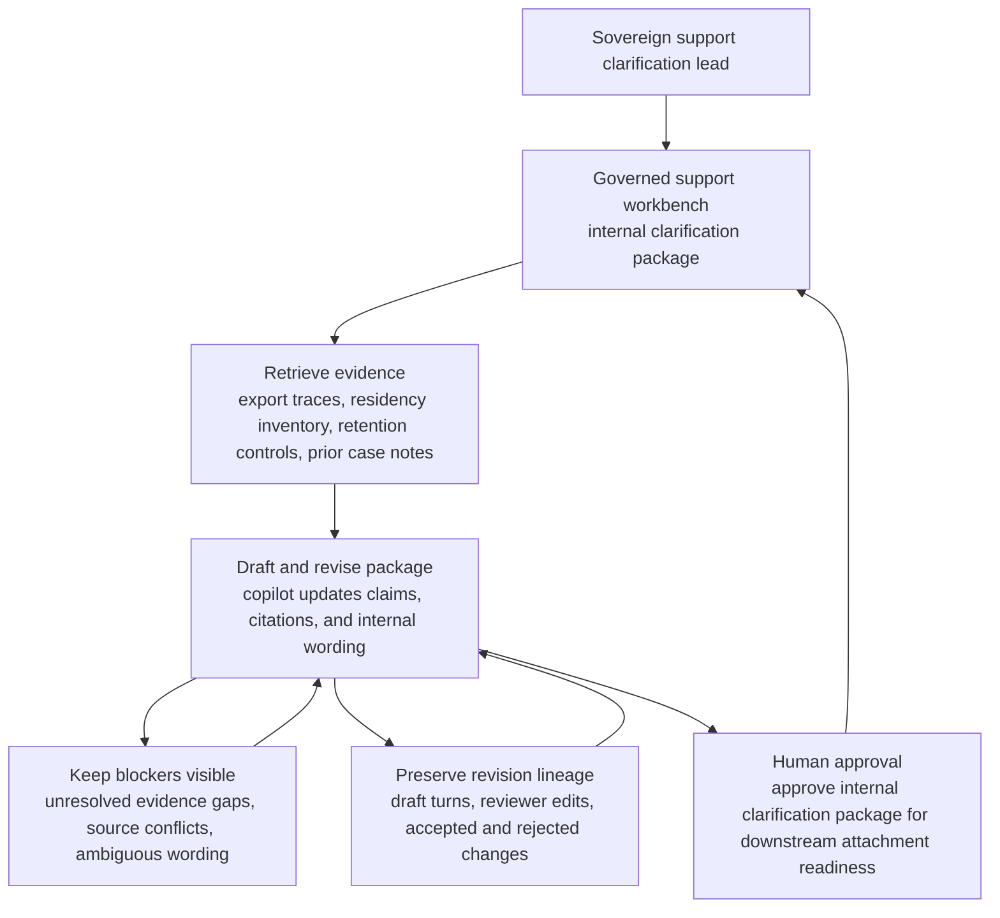
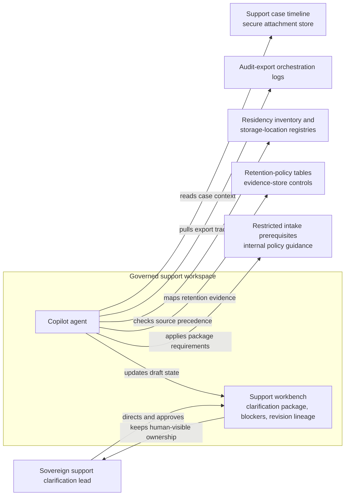

# Regulated customer audit-export residency clarification package copilot loop

## Linked pattern(s)

- `analyst-copilot-loop`

## Domain

Support.

## Scenario summary

A sovereign-support lead is preparing an internal clarification package after a residency-constrained customer asks where requested audit-export artifacts are generated, staged, and retained before the company's restricted compliance-review intake will even accept the case. The lead uses a copilot inside a governed support workspace to iteratively assemble the clarification package, pull export-job traces, residency inventory snapshots, staging-bucket controls, retention-policy mappings, and prior case notes, rewrite sections as privacy, platform, and compliance reviewers narrow what wording is supportable, and maintain an unresolved-blockers register plus revision lineage for each draft turn. The governed artifact stays internal: the human owner remains responsible for deciding which system facts are authoritative, whether the evidence is complete enough for restricted intake preparation, what ambiguities must remain visible, and approving the final clarification package before it is attached to any downstream review request. The workflow stops at the internal package; it does not authorize intake, choose a concession, grant export access, send a customer reply, or trigger any downstream execution.

## Target systems / source systems

- Governed support workbench holding the draft clarification package, reviewer comments, unresolved blockers, revision lineage, and explicit human ownership
- Support case timeline and secure attachment store containing the customer question, prior export-related escalations, approved contract-residency annex references, and internal notes
- Audit-export orchestration logs showing where export jobs are initiated, which processing region handles transformation, and where intermediate artifacts are staged before packaging
- Residency inventory, shard-mapping records, key-custody metadata, and storage-location registries used to establish source precedence for claims about generation, staging, and retention locations
- Retention-policy tables, purge schedules, and evidence-store controls showing how long audit-export artifacts and transient staging objects are kept
- Restricted compliance-review intake prerequisites and internal policy guidance defining what residency facts, blocker disclosures, and evidence references must be present before an intake package can later be assembled

## Why this instance matters

This grounds the collaboration pattern in support work where the governed artifact is an internal residency clarification package rather than a customer response, an intake authorization, or a remediation recommendation. The hard part is sustained mixed-initiative drafting across export-job evidence, residency-control records, reviewer edits, and source-precedence disputes without letting a polished copilot draft flatten uncertainty about where artifacts were actually generated, staged, or retained. The instance highlights why visible provenance, unresolved blockers, revision lineage, and explicit human ownership matter when a support team must prepare a review-ready clarification artifact for a sovereign customer context without drifting into downstream decision lanes.

## Likely architecture choices

- Human-in-the-loop collaboration should remain primary because residency interpretation, source precedence, and any statement that could shape restricted compliance-review posture require accountable support ownership.
- A tool-using single agent can retrieve export traces, compare residency inventory snapshots, refresh the claim-to-source matrix, and propose successive rewrites for the shared clarification package inside one governed workspace.
- The copilot may update the internal package, blocker register, and revision notes, but authorizing restricted intake, granting export access, changing retention settings, or sending any customer-facing statement should remain explicitly human-gated and outside this workflow.

## Governance notes

- The shared artifact should distinguish authoritative system records, lower-precedence operational notes, agent-drafted paraphrases, and human-approved conclusions so reviewers can see exactly where interpretation entered the package.
- Source precedence should be explicit: current residency inventory, storage-location registries, and retention-policy tables outrank informal case commentary; if export-job traces conflict with the authoritative inventory, the conflict should remain visible as a blocker rather than being normalized away.
- Every material claim about where audit-export artifacts are generated, temporarily staged, encrypted, transferred, or retained should link to inspectable evidence such as job ids, region codes, bucket or vault identifiers, policy versions, or control references; unsupported wording should not survive into the package.
- The unresolved-blockers register should keep open questions visible, including stale shard-residency snapshots, missing retention evidence for transient staging objects, ambiguous key-custody lineage, and any mismatch between platform documentation and current control telemetry.
- Revision lineage should preserve superseded package versions, reviewer-requested edits, accepted and rejected wording changes, and the reason each draft was narrowed so later reviewers can reconstruct how the clarification evolved.
- The named human owner should be the Sovereign Support Clarification Lead, who must approve any statement about residency boundaries, retention duration, staging behavior, control exceptions, or readiness for later restricted intake preparation.
- Sensitive tenant identifiers, storage paths, and key references should be minimized in the copilot context unless necessary for the clarification package and retained only in approved internal repositories with role-based access.
- If the evidence suggests current controls violate a contractual residency commitment or require a formal concession, the workflow should stop and hand off to the appropriate decision process rather than letting the copilot package drift into recommendation, authority selection, or external communication.

## Evaluation considerations

- Time to produce an internal-review-ready residency clarification package that preserves source precedence, blocker visibility, revision lineage, and explicit human ownership
- Reviewer correction rate for package sections where the copilot misstated artifact generation location, staging behavior, retention treatment, or the precedence of conflicting source records
- Completeness of the claim-to-evidence mapping, including whether each statement about generation, staging, retention, and key custody can be traced back to authoritative records
- Reliability of governance checkpoints that prevent the internal clarification package from being treated as intake authorization, customer communication, export approval, or a downstream remediation commitment without a separate human-governed workflow
