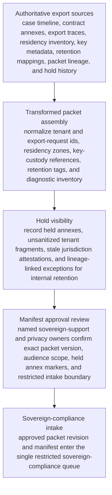
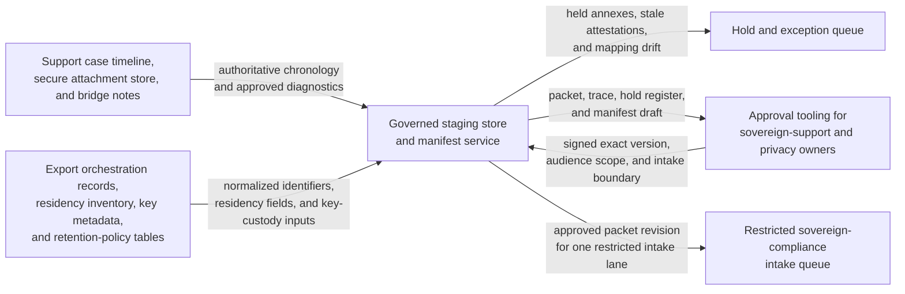

# Regulated customer audit-log export residency packet approved for restricted sovereign compliance intake

## Linked pattern(s)

- `approval-gated-transformation-release`

## Domain

Support.

## Scenario summary

A sovereign-support escalation team is preparing one exact residency-governed audit-log export packet revision for a regulated customer whose requested compliance export spans storage shards and key domains across multiple residency boundaries. The authoritative source state spans the customer case timeline, approved contract annexes, export job traces, shard-residency inventory, customer-managed key metadata, retention-policy mappings, prior exception packet lineage, and hold history for unsanitized tenant fragments or stale jurisdiction attestations that cannot leave the internal workspace yet. The downstream restricted lane expects one transformed packet with normalized tenant and export-request identifiers, residency-zone fields, key-custody references, retention tags, diagnostic inventory, held-annex markers, lineage links, and an approval manifest authorizing handoff into that single sovereign-compliance intake queue. The workflow must stop once that exact packet revision is approved for intake, without recommending a concession, adjudicating residency permissibility, communicating with the customer, broadening artifact access, or executing any export or remediation step.

## Target systems / source systems

- Enterprise support case timeline, secure attachment store, and export-failure bridge notes holding the authoritative chronology and approved diagnostic artifacts
- Audit-log export orchestration records, shard-residency inventory, key-management metadata, and retention-policy tables used to normalize packet identifiers and residency fields
- Governed staging store and manifest service that assemble the transformed sovereign-compliance intake packet, preserve lineage, and record held annexes that remain internal
- Approval tooling used by named sovereign-support and privacy operations owners to sign the exact packet version, audience scope, and restricted intake boundary
- Hold and exception queue for unsanitized tenant fragments, stale jurisdiction attestations, key-custody mismatches, or residency-zone mapping drift before any sovereign-compliance workflow receives the packet

## Why this instance matters

This grounds the pattern in support work where the important output is one downstream-ready transformed compliance packet revision rather than a recommendation, clarification memo, vendor escalation, or live export action. Sovereign-support teams often have to reshape messy export diagnostics and residency evidence into the exact intake structure a restricted compliance lane can accept while keeping blocked annexes, stale attestations, and jurisdiction conflicts explicit instead of hiding them inside a seemingly complete submission. The instance shows how approval-gated transformation release stays in-family when it centers on packet assembly, hold visibility, lineage preservation, and manifest-bound handoff rather than permissibility decisions, customer communication, vendor engagement, or downstream execution.

## Likely architecture choices

- Approval-gated execution fits because the sovereign-compliance packet may be technically complete for one restricted intake lane while remaining blocked until named support and privacy owners approve the exact version and audience scope in the manifest.
- Human-in-the-loop governance is required because accountable reviewers must confirm residency-safe diagnostics, held annexes, key-custody references, and the single downstream intake boundary before release.
- The workflow should emit only the transformed sovereign-compliance packet, transformation trace, hold register, lineage links, and approval manifest rather than a residency recommendation, exception decision, customer response draft, export enablement request, or remediation task.
- Approved reference data may normalize tenant ids, export job classes, jurisdiction codes, shard zones, and retention labels, but unsupported inference about lawful transfer, contractual relief, customer entitlement expansion, or technical fix timing should force a hold.

## Governance notes

- Every consequential field, especially tenant identity, export-request scope, shard residency, key-custody lineage, retention treatment, held diagnostic inventory, and sovereign-intake lane scope, should retain lineage to authoritative source records and the exact packet version approved for intake.
- The manifest should bind one exact packet revision, one restricted sovereign-compliance intake lane, signer identities, privacy scope, and any held annexes so downstream reviewers cannot inherit stale approval or broader reuse authority.
- The workflow should hold release when a jurisdiction attestation is older than the approved freshness window, key-custody metadata no longer matches the authoritative inventory, the packet exposes internal-only tenant fragments beyond the approved audience, or residency mappings changed after packet assembly began.
- Sovereign-support governance owners must approve packet-schema changes, audience-scope rules, and hold-release criteria; the workflow ends before residency adjudication, exception approval, customer disclosure, export execution, or downstream remediation.

## Evaluation considerations

- Percentage of approved sovereign-compliance packets accepted by the restricted intake lane without manual packet rebuilding or reopening raw support systems
- Rate of post-approval corrections caused by packet-version drift, hidden held annexes, stale jurisdiction attestations, or audience-scope mismatches
- Completeness of manifest binding between the approved packet revision, signer set, held diagnostics, lineage trace, and the single restricted intake boundary
- Reliability of supersession behavior when updated export traces arrive late, one held tenant fragment is cleared during approval review, or residency mappings change before the intake packet is consumed
