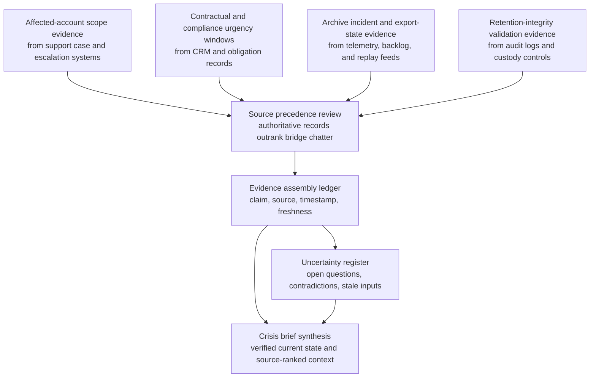
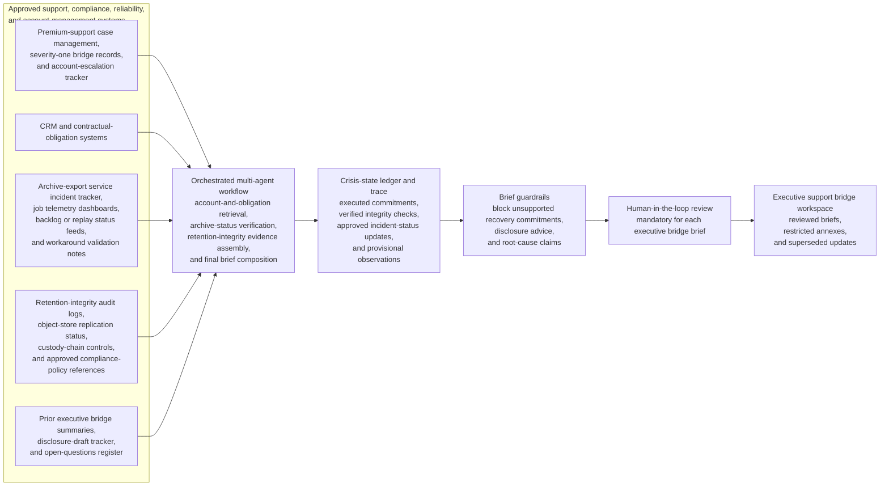

# Regulated customer compliance archive export failure executive bridge crisis briefing evidence synthesis

## Linked pattern(s)

- `crisis-briefing-evidence-synthesis`

## Domain

Support.

## Scenario summary

Support leadership has already activated an executive bridge after a compliance archive export failure leaves several regulated enterprise customers unable to retrieve retained communications ahead of active audit, legal-hold, or supervisory-review deadlines. Before anyone promises recovery timing, approves customer disclosures, grants exceptions, or coordinates downstream remediation, the workflow needs one grounded crisis brief that merges verified affected-account scope, contractual and compliance urgency windows, archive-service incident status, retention-integrity validation state, approved workaround availability, and unresolved customer-exposure questions. The useful output is a provenance-preserving support crisis brief that separates binding records-retention facts and verified export-state evidence from anecdotal bridge chatter, vendor speculation, or stale case commentary so human leaders can manage a high-stakes customer event from one inspectable narrative.

## Target systems / source systems

- Executive support bridge workspace where reviewed briefs, restricted annexes, and superseded updates are stored
- Premium-support case management system, severity-one bridge records, and account-escalation tracker for the affected regulated customers
- CRM and contractual-obligation systems showing retention commitments, named legal or compliance contacts, deadline-sensitive exceptions, and prior account-risk flags
- Archive-export service incident tracker, job telemetry dashboards, backlog or replay status feeds, and workaround validation notes shared for incident coordination
- Retention-integrity audit logs, object-store replication status, custody-chain controls, and approved compliance-policy references governing what can be stated about archive completeness
- Prior executive bridge summaries, disclosure-draft tracker, and open-questions register for continuity across fast successive updates

## Why this instance matters

This grounds the pattern in a support crisis where the hardest part is not restoring access or diagnosing the platform failure, but assembling one trustworthy customer-facing command picture around records availability, compliance urgency, and evidence integrity. Severe archive incidents blend account obligations, platform incident signals, retention controls, and deadline context from systems that carry different authority and refresh rates. The instance shows why the pattern should stay bounded: leaders first need evidence-backed context compression with explicit provenance and uncertainty before they choose disclosure, remediation, or exception-handling paths.

## Likely architecture choices

- An orchestrated multi-agent workflow can separate account-and-obligation retrieval, archive-status verification, retention-integrity evidence assembly, and final brief composition while maintaining one crisis-state ledger.
- Human-in-the-loop review should remain mandatory for each executive bridge brief because archive-completeness wording, legal-deadline framing, and workaround readiness can materially affect downstream disclosure and customer-risk decisions.
- The workflow should preserve a trace that distinguishes executed contractual commitments, verified archive-integrity checks, approved incident-status updates, and provisional bridge observations awaiting confirmation.
- Retrieval should stay inside approved support, compliance, reliability, and account-management systems; unsupported recovery commitments, disclosure advice, or root-cause claims should be blocked from the brief itself.

## Governance notes

- Executed retention commitments, records-governance updates, and incident-commander or service-owner status should outrank copied case comments, sales escalations, or informal vendor bridge notes when sources disagree.
- Customer-identifying details, legal-matter references, and archive-location specifics should be minimized in shared summaries, with restricted annexes used only for tightly scoped reviewers.
- Each briefing revision should show which archive-availability, backlog-clearance, or integrity-validation statements changed since the prior brief so executives do not rely on stale assumptions during a fast-moving bridge.
- Open questions such as incomplete export replay verification, uncertain legal-deadline applicability, or unconfirmed tenant-level archive completeness should remain explicit instead of being flattened into confident customer-status claims.

## Evaluation considerations

- Median time from executive bridge activation to reviewer-approved support crisis brief with complete provenance and freshness trace
- Percentage of material account-impact, contractual-obligation, archive-status, and integrity-validation statements backed by inspectable source references and timestamps
- Reviewer correction rate for source-precedence, customer-scope, or stale-case-comment handling across successive executive bridge briefs
- Rate at which unresolved customer-exposure, archive-completeness, or deadline-sensitivity ambiguities are surfaced explicitly before downstream disclosure, exception, or remediation decisions
