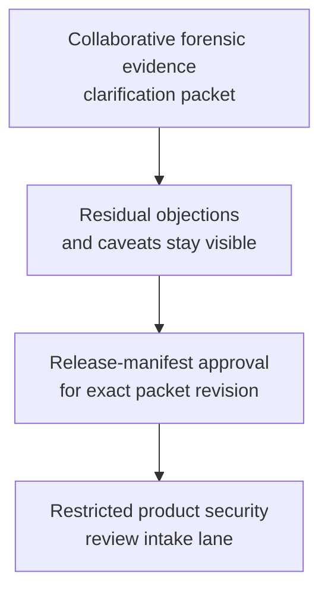
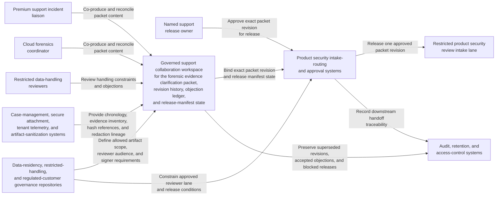

# Regulated customer forensic evidence clarification packet approved for restricted product security review intake

## Linked pattern(s)

- `approval-gated-collaborative-artifact-release`

## Domain

Support.

## Scenario summary

A premium support incident liaison, a cloud forensics coordinator, and restricted data-handling reviewers are co-producing one governed forensic evidence clarification packet because a regulated customer has submitted suspicious-access artifacts that need bounded internal security review before anyone broadens handling or treats the material as investigation-ready. Agents help reconcile customer-provided log excerpts, internal case chronology, tenant-scoped telemetry summaries, chain-of-custody annotations, redaction disputes, residency constraints, and reviewer objections into the shared packet while preserving which concerns remain unresolved and which residual caveats the human artifact owner accepted explicitly. The workflow ends only when the named support release owner approves that exact packet revision for one bounded restricted product security review intake lane, where downstream reviewers may decide whether the evidence package is sufficient for formal security assessment or needs narrower scope and fresher support. It does not classify the incident, authorize wider artifact transfer, notify the customer of a determination, or execute containment or remediation steps.

## Target systems / source systems

- Governed support collaboration workspace holding the forensic evidence clarification packet, revision history, objection ledger, and release-manifest state
- Case-management, secure attachment, tenant telemetry, and artifact-sanitization systems providing authoritative support chronology, approved evidence inventory, hash references, and redaction lineage
- Data-residency, restricted-handling, and regulated-customer governance repositories defining allowed artifact scope, approved reviewer audience, signer requirements, and the single downstream intake lane
- Product security intake-routing and approval systems used to release one approved packet revision into the restricted evidence-review lane
- Audit, retention, and access-control systems preserving superseded packet revisions, accepted residual objections, blocked-release reasons, and downstream handoff traceability

## Why this instance matters

This grounds the pattern in support through a governed evidence-clarification artifact rather than an outage disclosure packet, a recommendation package, or a transformed vendor intake. The reusable challenge is collaborative stewardship of one exact security-sensitive support artifact whose revision must be approved before it can cross into one bounded restricted product security review lane, while visible disagreement about redaction sufficiency, chain-of-custody continuity, residency limits, and telemetry interpretation remains inspectable instead of being polished away. The example stays inside the pattern boundary because incident classification, customer notification, export approval, and remediation or containment execution remain separate downstream workflows.

## Likely architecture choices

- Approval-gated execution fits because the clarification packet can be collaboration-ready while still blocked from restricted product security intake until the human release owner approves the exact revision.
- Human-in-the-loop control is required because only accountable support and restricted-data owners may accept residual evidence-handling uncertainty, confirm reviewer scope, and authorize the packet's release boundary.
- Agents may compare artifact inventories, refresh residency references, normalize objection wording, and maintain the release trace, but they must not decide incident severity, broaden evidence access, or trigger security response actions.

## Governance notes

- The release manifest should bind one exact packet revision, the named restricted product security review-intake lane, signer identities, approved artifact scope, and any residual objections the human release owner accepted explicitly.
- Conflicting telemetry interpretations, incomplete sanitization lineage, unresolved chain-of-custody gaps, and residency-bound attachment caveats should remain visible in the packet or boundary ledger rather than being normalized away before release.
- Audience scope should stay limited to the approved restricted review lane; reuse of the packet for customer communications, vendor escalation, broader incident distribution, or legal disclosure should require separate downstream approval.
- If new customer artifacts, revised residency constraints, or changed reviewer assignments alter the evidence picture materially during approval review, the workflow should hold release and supersede the prior packet revision rather than letting stale approval carry forward.

## Evaluation considerations

- Rate at which restricted product security intake accepts the released packet without discovering hidden evidence-scope drift, stale sanitization support, or audience-boundary mistakes
- Time required to keep one collaborative clarification packet synchronized as support chronology, artifact inventory, and signer state evolve
- Reliability of binding between the released artifact revision, accepted residual disagreement, approved artifact scope, and the bounded restricted product security review-intake lane
- Frequency with which humans reject agent-assisted edits because they drifted into incident adjudication, customer communication, broader artifact-sharing approval, or downstream security-response execution
