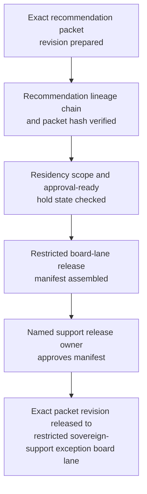
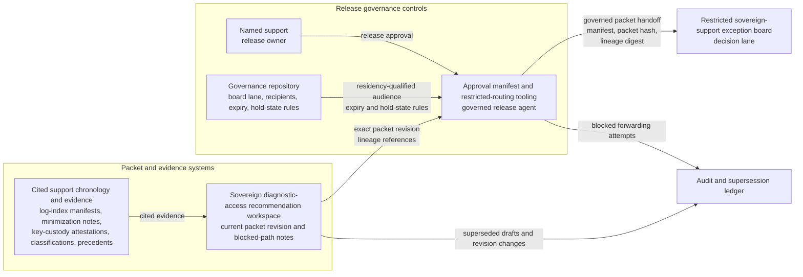

# Regulated customer sovereign diagnostic-log access concession recommendation packet revision approved for restricted sovereign-support exception board decision lane

## Linked pattern(s)

- `approval-gated-recommendation-release`

## Domain

Support.

## Scenario summary

A support workflow for a regulated sovereign-cloud customer has already prepared one exact recommendation packet revision for a diagnostic-log access concession after intermittent signature-validation failures in a tax-filing integration leave the customer unable to reconcile rejected submissions before a statutory deadline. The packet narrows the bounded options to release one time-boxed in-region supervised log-view concession through a sovereign review enclave, release a narrower metadata-correlation and support-analyst walkthrough package tied to prefiltered fields, or escalate to sovereign privacy and legal leadership, and it keeps blocked requests such as unrestricted raw-log export, non-resident engineer access, continuous SIEM forwarding, or direct production environment entry explicit. Before that exact packet revision can enter the restricted sovereign-support exception board decision lane, a named support release owner must approve the recommendation-lineage chain, residency-bound audience scope, approval-ready hold state, and release manifest so board reviewers receive the governed recommendation artifact rather than a stale, broadened, or partially held copy. The workflow stops at governed release of that packet revision; it does not adjudicate the concession, notify the customer, grant environment access, enable log transfer, or direct downstream remediation.

## Target systems / source systems

- Sovereign diagnostic-access recommendation workspace holding the current packet revision, bounded concession options, blocked-path notes, lineage references, and superseded drafts
- Support case chronology, sovereign-region log-index manifests, field-minimization review notes, key-custody attestations, tenancy-bound artifact classifications, and prior exception precedents already cited by the recommendation packet
- Governance repository defining the named restricted sovereign-support exception board lane, residency-qualified recipients, release expiry, hold-state rules, and the human owner who may approve packet release
- Approval manifest and restricted-routing tooling that records the exact packet hash, lineage digest, lane scope, residency controls, and any blocked forwarding attempts outside the approved sovereign audience
- Audit and supersession ledger used to hold older packet revisions when evidence lineage, diagnostic field scope, residency classification, or requested concession boundaries change before board review

## Why this instance matters

This grounds the pattern in support where the reusable challenge is release control over a sovereignty-sensitive diagnostic-access recommendation artifact, not troubleshooting execution or customer communication. Diagnostic-log concession packets can change late when field minimization review removes data elements, sovereign handling counsel narrows reviewer eligibility, fresh lineage evidence rebases the exact packet revision, or a broader access request invalidates the approval-ready hold state, so approval must bind to one reviewed revision and one restricted sovereign-support exception board lane instead of to a general permission to circulate access advice. The example keeps the family boundary explicit by ending at packet release for human review rather than board adjudication, concession execution, artifact transfer, environment changes, or customer-facing follow-through.

## Likely architecture choices

- Approval-gated execution fits because the recommendation packet remains blocked until a named support owner authorizes release into the restricted sovereign-support exception board decision lane.
- Human-in-the-loop review remains necessary because only accountable support and sovereign-governance owners should confirm lineage integrity, residency-bound audience scope, blocked-option visibility, and hold-state readiness without turning packet release into approval of the concession itself.
- A governed agent can verify packet hashes, compare lineage references, assemble the manifest, and block broadened distribution, but it should not grant log access, open support channels to non-resident staff, approve the exception, or trigger operational changes.

## Governance notes

- Approval should bind to one immutable packet revision, one lineage digest, one named restricted board lane, one bounded review window, and one exact concession option set so later edits cannot inherit release authority silently.
- Blocked requests such as raw-log export, non-resident reviewer access, persistent downstream forwarding, or direct production entry should remain visible in the released packet rather than being compressed into a cleaner diagnostic-access summary.
- Approval-ready hold-state logic should keep the packet unreleased when any cited evidence loses residency validation, when a fresh packet revision rebases the lineage chain, or when an annex needed to interpret blocked options is still pending sovereign review.
- Audit records should preserve the released packet id, option-set hash, lineage digest, approver identity, residency-qualified recipient scope, expiry timing, hold or supersession events, and any blocked redistribution attempts.

## Evaluation considerations

- Percentage of restricted-board releases where the diagnostic-log access concession recommendation packet revision, option-set hash, lineage digest, and manifest metadata match exactly without later correction
- Rate at which stale, superseded, held, or out-of-region diagnostic-access recommendation packets are blocked before sovereign exception board review
- Time required to move from packet-ready status to approved bounded board release when lineage evidence, residency controls, and hold-state conditions are complete
- Reviewer correction rate for missing blocked options, wrong residency-bound audience scope, or incomplete hold-state logic after the board receives the released recommendation packet
