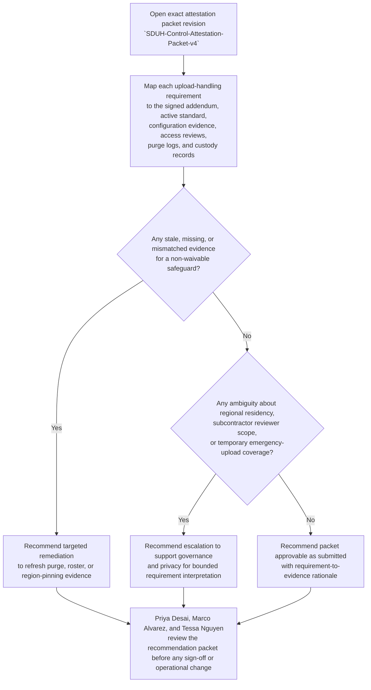
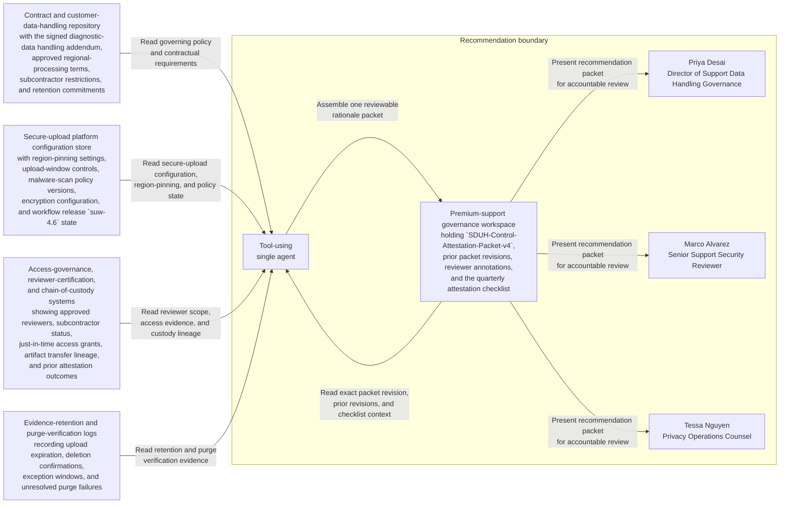

# Regulated enterprise secure diagnostic upload evidence-handling control attestation recommendation

## Linked pattern(s)

- `control-requirement-attestation-recommendation`

## Domain

Support.

## Scenario summary

Priya Desai, Director of Support Data Handling Governance, is preparing the quarterly internal attestation for one exact governed support packet, `SDUH-Control-Attestation-Packet-v4`, covering the restricted secure-upload lane used for regulated enterprise diagnostic artifacts in premium support. The prerequisite state is fixed before review begins: customer handling addendum `RDEH-A2` is fully executed for the governed account segment, secure-upload standard `SUP-STD-2026-02` is the active policy baseline, secure-upload workflow release `suw-4.6` is the production intake path, malware-scan policy `ScanPolicy-5.1` is current, and the approved reviewer roster for the restricted evidence lane has already been frozen for the quarter. Source precedence is explicit and must remain explicit in the recommendation: the signed customer diagnostic-data handling addendum and the active support evidence-handling standard outrank workflow runbooks or platform interpretations, those authoritative policy sources outrank current secure-upload configuration snapshots, access-review exports, purge-verification logs, and chain-of-custody records, and case comments or reviewer notes are advisory only when they conflict with the higher-order sources. Packet v4 supersedes `SDUH-Control-Attestation-Packet-v3` after refreshed retention and region-pinning evidence was attached, but visible blockers remain for the named human reviewers Marco Alvarez, Senior Support Security Reviewer, and Tessa Nguyen, Privacy Operations Counsel: one purge-verification log for an emergency upload window is still missing, one reviewer access-certification export predates a subcontractor rotation, and one failover test screenshot does not clearly prove the restricted bucket stayed pinned to the approved regional boundary. The workflow must recommend whether the packet is supportable as submitted, requires targeted remediation, or should escalate for bounded requirement interpretation before Priya Desai signs the attestation, before Marco Alvarez or Tessa Nguyen accept the evidence posture, and before anyone reopens uploads, broadens reviewer access, changes retention settings, communicates with the customer, or releases downstream diagnostic work.

## Target systems / source systems

- Premium-support governance workspace holding `SDUH-Control-Attestation-Packet-v4`, prior packet revisions, reviewer annotations, and the quarterly attestation checklist
- Contract and customer-data-handling repository containing the signed diagnostic-data handling addendum, approved regional-processing terms, subcontractor restrictions, and retention commitments
- Secure-upload platform configuration store with region-pinning settings, upload-window controls, malware-scan policy versions, encryption configuration, and workflow release `suw-4.6` state
- Access-governance, reviewer-certification, and chain-of-custody systems showing approved reviewers, subcontractor status, just-in-time access grants, artifact transfer lineage, and prior attestation outcomes
- Evidence-retention and purge-verification logs recording upload expiration, deletion confirmations, exception windows, and unresolved purge failures for the governed support lane

## Why this instance matters

This grounds the pattern in support through a low-risk but governance-heavy internal attestation problem around restricted diagnostic artifact handling rather than a concession recommendation, escalation-release packet, transcript transformation flow, or downstream specialist intake. The reusable challenge is deciding whether one exact support control packet demonstrates that secure uploads, reviewer access, retention limits, and regional restrictions still fit the approved evidence-handling requirements without letting urgency or convenience blur source precedence, visible blockers, or human accountability. It stays inside the recommendation boundary because the workflow does not approve the attestation, reopen the upload lane, grant reviewer access, rewrite policy, notify the customer, or initiate diagnostic analysis.

## Likely architecture choices

- A tool-using single agent can retrieve the exact packet revision, align each requirement to the signed addendum, active support standard, current upload-lane configuration, reviewer-certification evidence, and purge logs, and assemble one reviewable rationale packet.
- Human-in-the-loop review is required because Priya Desai remains accountable for the recommendation outcome and Marco Alvarez plus Tessa Nguyen must decide whether ambiguous residency or reviewer-scope evidence stays within delegated interpretation bounds.
- Read-only integration with support governance, contract, upload-platform, access-governance, and retention systems is preferable so the workflow cannot silently approve the attestation, expand access, alter retention timers, or reactivate customer upload paths.

## Governance notes

- The recommendation must stay attached to one exact governed artifact revision, `SDUH-Control-Attestation-Packet-v4`, while preserving lineage to `SDUH-Control-Attestation-Packet-v3` so reviewers can see what changed, which blockers were cleared, and which remain open.
- Source precedence must remain explicit in both the packet and the recommendation: the signed customer addendum and active support evidence-handling standard outrank implementation runbooks; those sources outrank configuration snapshots, reviewer rosters, access exports, purge logs, and chain-of-custody records; and reviewer commentary cannot silently override higher-precedence evidence.
- Prerequisite state must stay visible to the reviewers, including the active policy baseline, frozen restricted-reviewer roster, current malware-scan policy, approved upload workflow release, and the fact that the governed customer-handling addendum is still in force for the reviewed quarter.
- Visible blockers should remain inspectable rather than summarized away: the missing emergency-window purge confirmation, the stale reviewer-certification export after subcontractor rotation, and the failover screenshot that does not clearly prove continued regional pinning.
- Named accountability should remain explicit: Priya Desai owns the attestation recommendation packet, while Marco Alvarez and Tessa Nguyen are the named human reviewers for support-security and privacy-control fit.
- Diagnostic artifacts, tenant identifiers, reviewer identities, and upload-lane configuration details should remain visible only to authorized support governance, privacy, security, and audit reviewers under normal need-to-know and retention controls.
- The family boundary must stay explicit: approving the attestation, extending a temporary upload exception, changing reviewer scope, altering retention or region settings, sending customer communication, or releasing downstream diagnostic execution remains outside this workflow.

## Evaluation considerations

- Reviewer agreement with the recommended approve, remediate, or escalate posture without major corrections to source-precedence handling or requirement mapping
- Rate at which missing purge proof, reviewer-certification drift, or regional-residency ambiguity is surfaced before quarterly attestation sign-off
- Quality of traceability from each upload-handling requirement to the signed addendum, active support standard, configuration evidence, access-governance records, and purge-verification logs used
- Stability of recommendations when upload workflow releases, reviewer rosters, emergency exception windows, or regional-failover evidence changes during the review period
