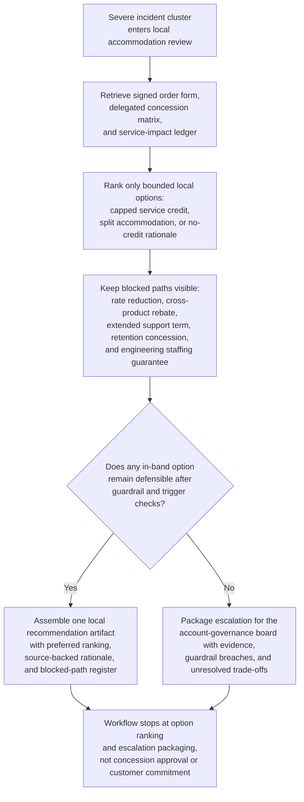

# Regulated enterprise severe-incident service-credit accommodation option recommendation

## Linked pattern(s)

- `delegated-authority-option-ranking`

## Domain

Support.

## Scenario summary

After three severe availability incidents in six weeks disrupt a regulated enterprise customer's identity and audit-export workloads, Maya Chen, the premium-support escalation manager for the account, must prepare one local recommendation artifact that ranks only the service-credit accommodation options still permitted inside her delegated authority band. The bounded option menu allows a capped one-month premium-support service credit, a narrower split accommodation that combines a smaller service credit with a temporary incident-review add-on already preapproved for the account tier, or a no-credit recommendation paired with documented rationale that the incident cluster fails the delegated trigger threshold. The workflow must keep source precedence explicit by favoring the signed premium-support order form, the current delegated concession matrix, and the post-incident service-impact ledger ahead of sales notes or bridge commentary; it must preserve blocked requests such as a permanent rate reduction, cross-product rebate, extended free premium-support term, nonstandard retention concession, or direct engineering staffing guarantee; and it must package escalation for the account-governance board only if no in-band accommodation remains defensible. The artifact stops at local option ranking and escalation packaging rather than approving a concession, making a customer commitment, drafting customer communications, assigning engineering work, rewriting policy, or executing downstream billing changes.

## Target systems / source systems

- Premium-support case timeline, major-incident review notes, service-impact ledger, and prior accommodation history for the affected regulated account
- Delegated support concession matrix covering service-credit percentage caps, allowed temporary support add-ons, blocked concession types, precedent checks, and escalation thresholds
- Signed premium-support order form, negotiated service-level addenda, and entitlement register used to confirm which products and support scopes are inside the current contract baseline
- Account-governance precedent log, renewal-sensitivity notes, prior override register, and exception-packet templates for out-of-band accommodation requests
- Recommendation audit trail and revision ledger that preserve reviewer comments, preferred-option changes, blocked-path rationale, and escalation-packet completeness checks

## Why this instance matters

This grounds the pattern in support through a governance-heavy accommodation-ranking problem that stays local to premium-support authority rather than drifting into commercial adjudication or incident-command activity. The reusable challenge is deciding which allowed service-credit path is safest and most defensible when the customer is pressing for broader commercial concessions after repeated severe incidents, while the support team must keep hard guardrails, blocked asks, and escalation packaging visible instead of letting urgency collapse the case into an implied approval.

## Likely architecture choices

- A tool-using single agent can retrieve the concession matrix, contract baseline, incident-impact evidence, prior accommodations, and override history and produce one bounded ranking of in-band accommodation options for Maya Chen to review.
- Human-in-the-loop review remains necessary because the premium-support escalation manager owns whether the ranked local recommendation is acceptable to send onward inside support governance or whether escalation packaging should be prepared for the higher board.
- Read-only integration with support, contract, billing-context, and governance systems is preferable so the workflow cannot silently issue credits, extend service terms, assign engineering resources, or transmit a customer-facing offer.

## Governance notes

- Source precedence should remain explicit: signed contract terms and the delegated concession matrix outrank service-impact summaries, which outrank CRM commentary or renewal speculation when the workflow compares allowed options.
- Prerequisite state should remain visible before any local recommendation is treated as complete, including confirmation that incident severity classification is closed, the service-impact ledger is reconciled, the current quarter's concession-cap balance is current, and no unresolved billing dispute is distorting the accommodation basis.
- The output should distinguish allowed in-band accommodations, conditionally allowed paths that depend on refreshed impact accounting or precedent fit, blocked requests such as permanent rate reduction or multi-product rebate, and escalation-only asks such as out-of-band retention concessions or executive access commitments.
- Revision lineage should preserve which reviewer comments changed the preferred ranking, why any option was downgraded or removed, and whether repeated blocked requests suggest the case is drifting beyond delegated support scope.
- Audit records should preserve Maya Chen as the named local owner, the compared option set, source references used, blocked-option rationale, guardrail checks, and the exact escalation packet contents if local authority is exhausted.

## Evaluation considerations

- Rate at which accepted local accommodation recommendations stay inside premium-support delegated authority without later finance, legal, or account-governance correction
- Frequency with which blocked concession requests are surfaced before anyone implies a customer commitment or opens downstream billing work
- Time required to produce a complete bounded recommendation packet after the severe-incident cluster enters local accommodation review
- Stability of option ranking when incident-impact accounting, precedent fit, renewal sensitivity, or quarter-to-date concession usage changes during the same review cycle
