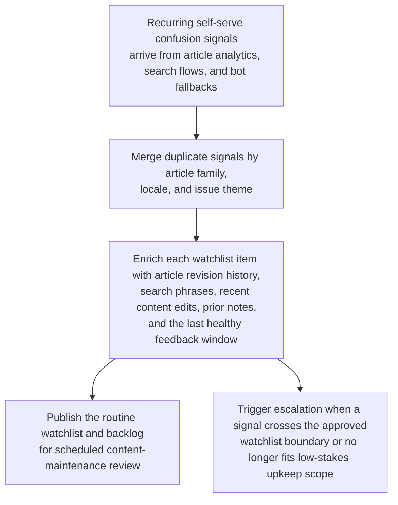
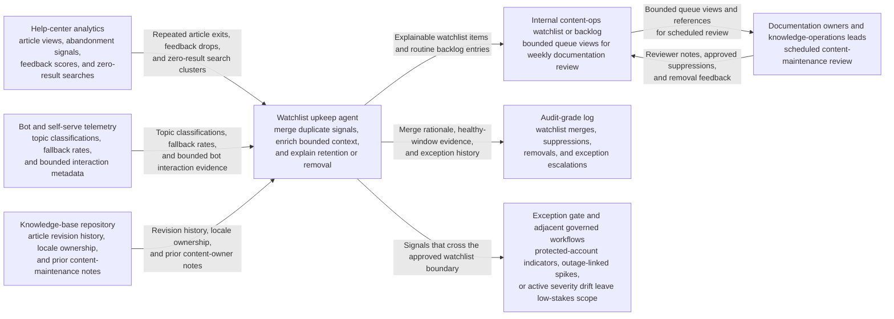

# Self-serve article confusion watchlist upkeep

## Linked pattern(s)

- `explainable-watchlist-maintenance`

## Domain

Support.

## Scenario summary

A support knowledge-operations team monitors recurring low-severity self-serve confusion signals across help-center articles, troubleshooting search flows, and deflection bots: repeated zero-result searches, abrupt article exits after one step, clusters of thumbs-down feedback, and repeated fallback-to-chat sessions tied to the same low-stakes help topic. The workflow must merge duplicate signals by article family, locale, and issue theme, enrich each watchlist item with article revision history, search phrases, recent content edits, prior content-owner notes, and last healthy feedback window, and then publish a routine backlog for documentation owners to review during scheduled content-maintenance cycles. The goal is to keep recurring friction visible for content hygiene and coverage improvement, not to reroute live escalations, draft customer promises, or decide whether a support policy exception should be granted.

## Target systems / source systems

- Help-center analytics with article views, abandonment signals, feedback scores, and zero-result search patterns
- Bot and self-serve telemetry with topic classifications, fallback rates, and bounded interaction metadata
- Knowledge-base repository with article revision history, locale ownership, and prior content-maintenance notes
- Internal content-ops watchlist or backlog used for weekly documentation review
- Audit-grade log preserving watchlist merges, suppressions, removals, and exception escalations

## Why this instance matters

This grounds `explainable-watchlist-maintenance` in support work where recurring weak signals matter operationally but rarely justify immediate anomaly review or human escalation. Knowledge teams need a low-risk way to keep persistent article friction visible without turning every confusing search pattern into a case investigation or customer-facing response. The instance stays inside monitor/detect/triage because the workflow ends at explainable watchlisting and routine attention routing rather than live-ticket prioritization, recommendation of concessions, or article publication decisions.

## Likely architecture choices

- Event-driven monitoring fits because watchlist entries should refresh as new article-feedback clusters, search patterns, and bot fallback signals arrive.
- A tool-using single agent can merge confusion signals by topic and locale, attach bounded article-history context, and publish one routine content-maintenance queue.
- Exception-gated autonomy works because routine low-severity watchlist updates can proceed without approval, while protected-account indicators, outage-linked spikes, or signals that resemble active severity drift should escalate to adjacent workflows.
- Publishing new customer-facing copy, reprioritizing live support queues, or deciding whether a friction pattern reflects product risk should remain outside this low-risk monitoring workflow.

## Governance notes

- Queue views should minimize customer text, account identifiers, and raw conversation content, using bounded aggregates or references unless an authorized reviewer needs deeper evidence.
- Watchlist explanations should show why a signal remained visible, why duplicates were merged, and what healthy-state evidence would remove the item, so content owners can trust the upkeep logic.
- Reversibility should stay explicit: queue placement, merges, and suppressions can be recomputed as article revisions land or search behavior stabilizes, but recurring friction that is suppressed too aggressively may delay needed content updates.
- Auditability should preserve feedback-window boundaries, revision links, suppression rationale, and exception escalations so knowledge-operations leads can inspect whether the watchlist stayed within low-stakes scope.

## Evaluation considerations

- Percentage of recurring self-serve confusion signals surfaced in time for scheduled content maintenance without creating live-support alert fatigue
- Reduction in duplicate content-ops backlog items through merged watchlist entries by article family and locale
- Median time from recurring low-feedback or zero-result search patterns to an explainable watchlist item with bounded context
- Rate at which watchlist items were removed only after healthy article-feedback windows returned rather than through premature suppression
- Content-owner override rate for watchlist entries that were under-explained, over-retained, or should have escalated to a higher-governance workflow
