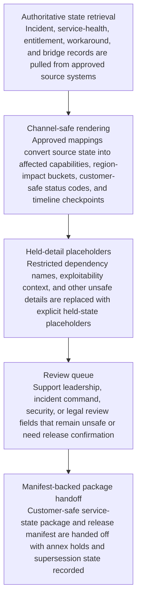

# Severity-one customer bridge channel-safe service-state package

## Linked pattern(s)

- `critical-channel-safe-state-packaging`

## Domain

Support.

## Scenario summary

A severity-one customer bridge is active for a managed-service outage that affects several production regions and involves internal security-sensitive dependency detail that cannot be exposed directly to the customer or every support participant. The authoritative state spans incident records, service-health systems, entitlement and contractual metadata, workaround trackers, dependency maps, security review notes, and bridge timelines that change quickly as engineering confirms what is safe to share externally. Before account leadership, incident management, and the customer-facing bridge can align on one sanctioned artifact, the workflow must transform that state into a channel-safe structured service-state package with affected-capability fields, region-impact buckets, customer-safe status codes, workaround-readiness markers, timeline checkpoints, held-detail placeholders for restricted dependency or exploitability context, and a release manifest that records which annexes remain internal only.

## Target systems / source systems

- Incident, service-health, and dependency systems holding authoritative outage and workaround state
- Entitlement, contract, and account metadata systems that define which customer-facing fields are permitted or required
- Security and disclosure-policy tooling governing which failure details, exploitability notes, or internal component names must remain held
- Bridge-package workspace and lineage store for customer-safe service-state records, restricted annexes, and supersession history
- Review queue for incident command, support leadership, security, or legal review when package fields cannot be released safely

## Why this instance matters

This grounds the pattern in a support workflow where the hard problem is transforming live incident state into a trustworthy customer-safe representation, not writing a broad narrative brief or deciding on credits, escalations, or remediation strategy. Severity-one bridges often suffer when teams either overshare internal detail that should stay restricted or under-share enough state that customer coordination degrades into confusion. The instance shows why critical transform work needs explicit hold placeholders, audience-safe status rendering, and versioned manifests so support can communicate from one governed package without crossing into response promises or downstream operational commitments.

## Likely architecture choices

- An orchestrated multi-agent workflow can divide authoritative-state retrieval, customer-safe rendering, held-detail validation, and manifest publication while keeping each transformation stage inspectable.
- Human reviewers should remain embedded because incident command, security, and account leadership must approve what leaves the internal bridge and what stays in restricted annexes.
- The workflow should stop at the customer-safe structured package and release manifest rather than recommending service credits, drafting commitments, or triggering remediation execution.
- Approved rendering tables may normalize component state into customer-safe capability labels and map workaround readiness into controlled status codes, but unsupported inference about root cause, attack scope, or contractual remedy should stay out of scope.

## Governance notes

- Every exposed service-state field, region-impact bucket, workaround marker, and held-detail placeholder should retain lineage to authoritative incident or entitlement sources plus the exact profile rules used for customer-safe rendering.
- The workflow should route exceptions when security review has not cleared a dependency detail, when internal and customer-facing status timing disagree, or when new evidence would materially change what a previously released package implied.
- Supersession history should show which package version was shared on the customer bridge and which internal-only annexes remained withheld at each stage.
- Support leadership, incident command, security, and legal reviewers must approve profile changes or hold releases; the transform workflow ends before concessions, external commitments, or system actions are made.

## Evaluation considerations

- Percentage of customer-bridge package versions accepted without reopening internal-only incident systems during the live event
- Rate of restricted-detail leakage, stale-state, or misleading customer-safe rendering findings discovered after package release
- Completeness of lineage and hold-state explanation for affected-capability fields, region-impact buckets, and workaround readiness markers
- Reliability of the package when service state changes rapidly, entitlement context shifts, or security review narrows what can be disclosed mid-incident
