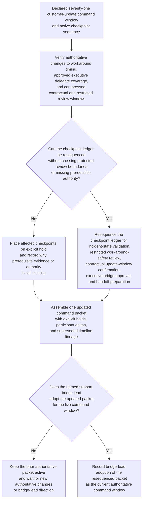
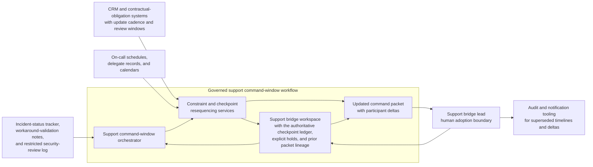

# Severity-one customer-update command-window checkpoint resequencing

## Linked pattern(s)

- `critical-command-window-resequencing`

## Domain

Support.

## Scenario summary

A premium-support organization has already declared a severity-one customer-update command window for a strategic managed-service outage with an active checkpoint sequence for incident-state validation, restricted workaround-safety review, contractual update-window confirmation, executive support-bridge approval, and customer-bridge handoff preparation. Then authoritative conditions change inside the same governed window: workaround verification finishes later than planned, the named executive support approver rotates to an approved delegate during the live bridge, and the latest defensible customer-update handoff moves earlier because the customer's contractual review slot and internal restricted-review window compress. The workflow must resequence the live checkpoint order, preserve one authoritative checkpoint ledger with explicit holds where prerequisite evidence or authority is still missing, show participant deltas for the materially affected support, incident, security, and account owners, and hand one updated command packet to the named support bridge lead for adoption before any customer update, concession discussion, remediation commitment, or downstream execution begins.

## Target systems / source systems

- Severity-one support bridge workspace containing the declared command scope, current checkpoint order, protected customer-update and executive-review windows, and prior command packets
- Incident-status tracker, workaround-validation notes, and restricted security-review log publishing authoritative checkpoint-completion and dependency changes
- CRM and contractual-obligation systems defining the committed update cadence, named customer contacts, account severity terms, and protected review windows
- On-call schedules, delegate records, and calendars for support bridge leadership, incident command, security review, account management, and customer-success participants
- Audit and notification tooling used to record superseded timelines, explicit holds, participant deltas, and the currently adopted support command packet

## Why this instance matters

This grounds the pattern in a severe support workflow where the urgent problem is keeping one trustworthy internal command timeline for customer-update coordination after authoritative timing, delegate, and review-window conditions shift mid-bridge. The workflow is not deciding what to say to the customer, choosing a remediation path, negotiating concessions, or executing the workaround itself. Instead, it preserves a current checkpoint sequence with visible holds and one human adoption boundary so support, incident, security, and account teams coordinate from the same governed timeline before any consequential customer-facing or operational step begins.

## Likely architecture choices

- An orchestrated multi-agent workflow can separate authoritative incident-state intake, protected-window checking, checkpoint resequencing, participant-delta assembly, and command-packet publication while preserving one shared support bridge ledger.
- Human-in-the-loop control fits because the support bridge lead must adopt any materially changed checkpoint order before the new packet becomes authoritative for live customer-update coordination.
- The workflow should preserve explicit hold states when workaround verification, delegate authority, contractual timing, or restricted review readiness do not yet support an in-policy checkpoint move.
- The workflow should stop at the resequenced checkpoint ledger, hold register, and participant-delta packet rather than drafting customer language, approving concessions, committing to remediation timing, or triggering downstream execution.

## Governance notes

- Protected checkpoints such as restricted workaround-safety review, contractual update-window confirmation, executive support-bridge approval, and customer-bridge handoff preparation should remain explicit before resequencing occurs, especially when customer and internal review windows tighten.
- Delegate changes should be accepted only from approved support-leadership and incident-command mappings, not from ad hoc bridge substitutions, chat assumptions, or informal calendar edits.
- The authoritative command packet should expose role-relevant checkpoint timing, hold state, and participant deltas without broadening access to restricted incident evidence, customer-sensitive contract detail, or security-review notes.
- Human support bridge ownership is required before the updated sequence becomes authoritative for consequential customer-bridge coordination, executive status review, concession handling, or workaround handoff.

## Evaluation considerations

- Time from an authoritative incident, delegate, contractual-window, or restricted-review change to a human-reviewable resequenced support command packet
- Rate at which blocked or cross-boundary customer-update checkpoints remain visible in the hold register instead of being flattened into an invalid final timeline
- Agreement between the workflow's resequenced checkpoint ledger and the final human-adopted support command sequence for the declared severity-one window
- Stability of the resequencing loop when multiple incident, account, and protected-review conditions change within the same live customer-update bridge
