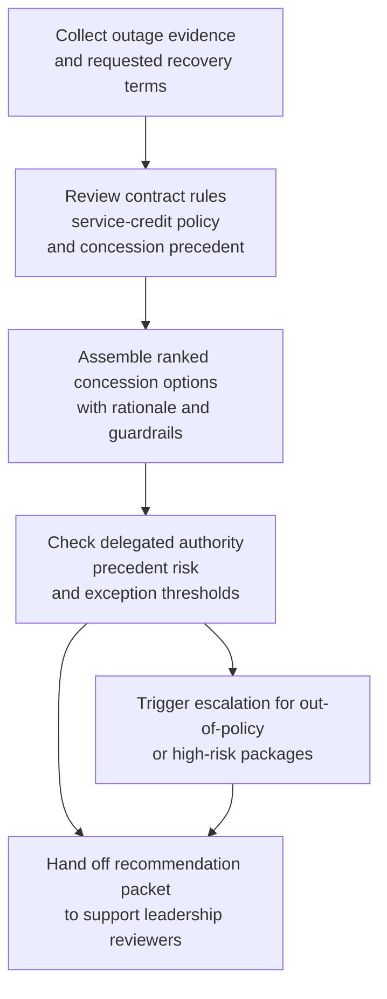
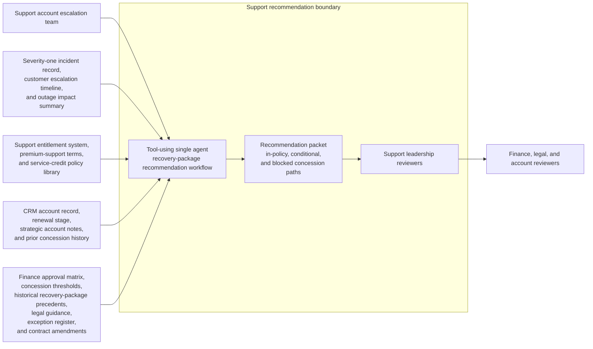

# Severity-one service-credit and recovery-package recommendation

## Linked pattern(s)

- `deal-desk-recommendation-support`

## Domain

Support.

## Scenario summary

After a prolonged identity-service outage affecting a global enterprise customer, the support account escalation team must recommend whether to offer the requested recovery package of service credits, temporary premium-support staffing, and waived overage charges, counter with a narrower package tied to documented impact, or escalate because the combined concession would exceed delegated authority or set a risky precedent. The workflow weighs contractual service-credit rules, outage severity evidence, customer tenure and renewal context, prior concession history, and stakeholder input from support leadership, customer success, finance, and legal before anyone makes a customer-facing commitment.

## Target systems / source systems

- Severity-one incident record, customer escalation timeline, and outage impact summary
- Support entitlement system, premium-support terms, and service-credit policy library
- CRM account record, renewal stage, strategic account notes, and prior concession history
- Finance approval matrix, concession thresholds, and historical recovery-package precedents
- Legal guidance, approved exception register, and customer-specific contract amendments

## Why this instance matters

This instance grounds the recommendation family in support without drifting into incident management, entitlement synthesis, or customer communication execution. The hard problem is deciding what concession path is defensible and who must approve it when policy thresholds, precedent risk, and account context all matter more than simply restating what happened in the outage.

## Likely architecture choices

- A recommendation-only workflow can retrieve outage facts, entitlement terms, prior concessions, approval thresholds, and stakeholder notes into one ranked option set for support leadership review.
- Human-in-the-loop review is mandatory because the workflow should advise on concession structure and escalation triggers, not approve credits, amend support commitments, or send the offer to the customer.
- Read-only integration with incident, CRM, entitlement, finance, and contract systems is preferable so the agent cannot silently convert a recommendation into billing changes, contract edits, or customer-facing promises.

## Governance notes

- The output should distinguish in-policy credit paths, conditional recovery options that require additional approval, and blocked concessions that exceed service-credit, spend, or precedent guardrails.
- Any recommendation that relies on historical precedent should show whether the earlier case matched outage duration, contracted support tier, customer segment, renewal posture, and prior exception basis.
- Requests that would create nonstandard support obligations, exceed delegated concession authority, or conflict with contractual limitation language should trigger explicit escalation rather than weighted scoring alone.
- Customer outage evidence, commercial renewal context, and prior concession records should remain visible only to authorized support, finance, legal, and account reviewers under normal confidentiality controls.

## Evaluation considerations

- Reviewer agreement with the recommended concession package and escalation route before any customer-facing commitment is made
- Rate at which policy, contract, or precedent blockers are surfaced before credits or recovery promises are communicated
- Quality of evidence linking outage impact, entitlement terms, historical concessions, and approval thresholds to the recommendation
- Stability of recommendations when customer impact estimates, renewal context, or requested concessions change during executive review
