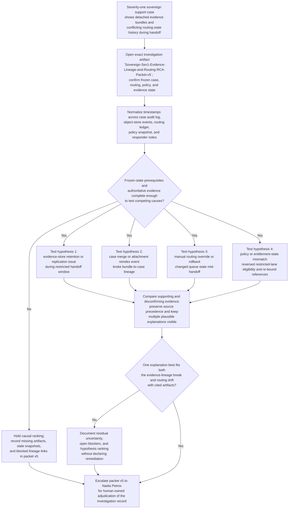

# Severity-one sovereign support case evidence-loss and routing-state root-cause investigation

## Linked pattern(s)

- `incident-root-cause-analysis`

## Domain

Support.

## Scenario summary

A severity-one sovereign support case for a regulated enterprise enters a restricted escalation handoff after a production-impacting outage, but the investigation packet being assembled for the handoff shows two coupled discrepancies: uploaded diagnostic bundles that were visible in the case several minutes earlier now appear detached from the escalation workspace, and the case routing state oscillates between the sovereign queue, a restricted advanced-diagnostics queue, and a general enterprise escalation queue. The support organization must determine which evidence-backed explanation best accounts for both the apparent evidence loss and the routing-state drift without assuming that either symptom is merely presentational. Plausible competing causes include an evidence-store retention or replication failure during the restricted handoff window, an erroneous case-merge or attachment-reindex event that broke lineage between the case and its uploaded bundles, a manual routing override applied during the handoff without the expected case-state freeze, or a case-policy and entitlement-state mismatch that caused the restricted queue transfer to be rolled back while evidence references were being re-bound. The investigation stays bounded to one exact governed artifact, `Sovereign-Sev1-Evidence-Lineage-and-Routing-RCA-Packet-v5`, owned by Nadia Petrov, Director of Sovereign Support Escalation Integrity, and ends at a ranked explanation set with explicit uncertainty rather than evidence restoration, routing-rule changes, customer communication, security declaration, or downstream operational action.

**Prerequisite state that must be confirmed before narrowing hypotheses:**
- The active case record is frozen against additional merges, attachment deletions, and queue-transfer edits except for explicitly logged read-only investigation access.
- The current routing-state snapshot, queue-membership ledger, and entitlement or sovereign-policy snapshot for the case have been exported and timestamped.
- The evidence object-store retention hold for the incident window is active, and object-version history for the uploaded bundles is preserved.
- The handoff workspace already contains the prior packet revision, `Sovereign-Sev1-Evidence-Lineage-and-Routing-RCA-Packet-v4`, plus sealed responder notes from the sovereign support lead and restricted escalation coordinator.
- The incident window and exact bundle identifiers in scope have been agreed so older unrelated uploads are excluded unless promoted back into scope with citation.

## Target systems / source systems

**Authoritative (highest precedence):**
- Support case audit ledger for the incident case, including attachment-link events, queue-transfer history, merge or unmerge actions, and immutable actor timestamps
- Evidence object-store version history and retention-hold records for the uploaded diagnostic bundles, including object identifiers, replication status, delete markers, and access-scope metadata
- Restricted support routing-policy snapshot and entitlement or sovereign-support eligibility record captured for the handoff window

**Operational and contextual (secondary precedence):**
- Restricted escalation workspace contents, prior packet revision `Sovereign-Sev1-Evidence-Lineage-and-Routing-RCA-Packet-v4`, and responder annotations attached during the handoff
- Queue-monitoring telemetry, transfer-attempt logs, attachment-indexing job traces, and case-search results visible to sovereign and advanced-diagnostics teams
- Responder notes from the sovereign support lead, routing coordinator, and duty manager documenting what they observed before and after the discrepancy surfaced

**Excluded from authoritative use without explicit promotion:**
- Informal chat excerpts or screenshots that are not linked to the case audit ledger, routing log, or object-store event history
- Customer restatements of which files were uploaded unless they match the bundle identifiers preserved in the evidence store or case audit trail
- Later remediation tickets, routing-rule edits, or evidence reattachment attempts created after the frozen investigation window

## Why this instance matters

This grounds `incident-root-cause-analysis` in support through a severe escalation scenario where the investigation problem is not merely missing files or a mislabeled queue, but the need to reconcile two coupled discrepancies across governed support systems without collapsing quickly into a single operational story. The instance is structurally distinct from entitlement-drift analysis because it centers one exact RCA packet revision, explicit source precedence between case, evidence-store, and policy records, a prerequisite frozen state before hypothesis narrowing, visible blockers that can stop causal ranking, and revision-aware lineage across packet versions while keeping the work inside investigation only. It also reflects a common support governance challenge in regulated or sovereign lanes: the team must explain whether the system of record lost evidence lineage, misrouted the case, or surfaced an eligibility rollback, and must do so in a way Nadia Petrov can inspect and own without delegating authority for restoration, queue changes, or customer-facing conclusions to the workflow itself.

## Likely architecture choices

- An orchestrated multi-agent flow can separate case-audit retrieval, evidence-lineage reconstruction, routing-state reconciliation, and hypothesis verification while preserving one shared RCA packet.
- Shared case memory should retain source-precedence decisions, frozen-state checks, rejected explanations, open blockers, and the packet lineage from `v4` to `v5` so later reviewers can see how the investigation evolved.
- Human-in-the-loop review remains mandatory before any explanation is treated as the primary cause because the packet may affect sovereign support accountability, restricted-lane governance, and any downstream restoration or routing decisions.
- Read-only integrations should be preferred for case, object-store, routing, and policy evidence collection so the investigation does not mutate the very state it is attempting to explain.

## Governance notes

- The investigation record should cite the exact authoritative artifact behind each claim and state clearly when responder observations conflict with case or object-store records rather than smoothing those conflicts away.
- Source precedence must remain explicit: the case audit ledger, object-store version history, and captured routing or eligibility snapshot outrank workspace views, job traces, and human notes; lower-precedence evidence can contextualize but not silently override the authoritative record.
- The packet must preserve visible blockers such as missing replication acknowledgements, unresolved merge lineage, absent routing-override tickets, or stale eligibility snapshots instead of forcing a single-cause narrative when the evidence is incomplete.
- Revision-aware lineage should show what changed from `Sovereign-Sev1-Evidence-Lineage-and-Routing-RCA-Packet-v4` to `v5`, including newly attached evidence links, demoted hypotheses, and still-open uncertainty, so later review can audit the reasoning path.
- Nadia Petrov remains the named human owner for the investigation packet; evidence restoration, queue reassignment, policy interpretation, customer updates, and broader incident handling are separate downstream decisions that this workflow does not perform.
- Access to raw bundle metadata, sovereign-lane routing records, and responder notes should remain restricted to the regulated support investigation group during the RCA process.

## Evaluation considerations

- Time to first evidence-backed explanation that accounts for both the detached-bundle symptom and the routing-state discrepancy with cited authoritative artifacts
- Whether prerequisite frozen-state checks and source-precedence rules prevent the workflow from ranking causes before the case audit, object-store, and policy snapshots are complete
- Agreement between the workflow's ranked hypothesis set and Nadia Petrov's final accepted investigation conclusion, including whether residual uncertainty was preserved when one cause could not be fully isolated
- Rate at which missing lineage records, stale routing snapshots, or unsupported responder claims surface as explicit blockers rather than being normalized into overconfident conclusions
- Inspectability of packet lineage from `v4` to `v5`, including which hypotheses were strengthened, weakened, or left open as new evidence was reconciled
