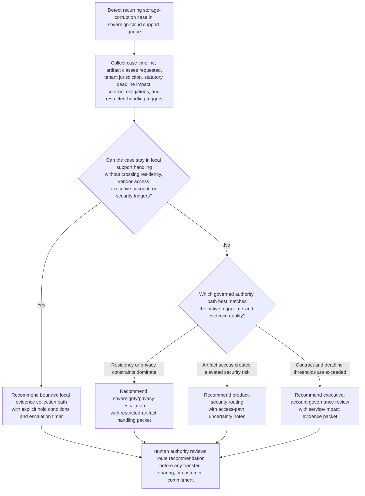

# Sovereign-cloud storage-corruption restricted-artifact escalation routing

## Linked pattern(s)

- `policy-constrained-escalation-routing`

## Domain

Support.

## Scenario summary

A sovereign-cloud support lead is handling a severity-one storage-corruption case for a public-sector tenant after repeated write failures begin affecting a tax-filing workload near a statutory deadline. The frontline support pod can gather case history, classify the likely artifact types needed for deeper investigation, and document current customer-impact exposure, but it cannot authorize export of tenant-linked crash dumps outside the sovereign region, grant vendor engineers access to restricted artifacts, trigger executive-account governance review on behalf of the customer, or accept prolonged degraded service while privileged review is delayed. The workflow must recommend the right governed escalation route - such as sovereignty and privacy review when data-residency triggers fire, product security review when artifact contents or access paths create elevated handling risk, and executive-account governance when contract and deadline-impact thresholds are exceeded - assemble the supporting policy and evidence packet, keep blocked local-only paths visible, and stop before any authority approves artifact transfer, vendor intake, customer commitments, or remediation work.

## Target systems / source systems

- Sovereign-cloud support case system with severity history, incident notes, customer-impact timeline, and current ownership state
- Artifact catalog and evidence manifest showing requested crash dumps, trace bundles, region tags, encryption status, and retention windows
- Sovereignty, privacy, and data-handling policy library covering in-region processing rules, transfer prohibitions, and approved reviewer classes
- Product security and restricted-vendor intake criteria defining when artifact access requires higher review or protected channels
- Executive-account governance records with contractual deadlines, named-account commitments, prior exception history, and escalation thresholds
- Audit logs for earlier artifact-access requests, denied transfers, and prior governed handoff decisions on the same account

## Why this instance matters

This grounds the pattern in support through a high-consequence routing problem where the main value is choosing the right governed authority path before restricted evidence is mishandled. The hard part is not diagnosing the storage fault itself but determining when frontline support must stop local handling because sovereign-region controls, artifact-access risk, contract thresholds, or executive-account obligations move the case beyond local authority.

## Likely architecture choices

- A recommendation-only workflow can combine case severity, artifact metadata, sovereignty policy triggers, security review criteria, and executive-account thresholds into one ranked escalation-route recommendation.
- Human-in-the-loop review is mandatory because privacy, security, and executive-account authorities must decide whether to accept the recommended route and what downstream handling to authorize.
- Read-only integration with case, artifact, policy, security, and account-governance systems is preferable so the workflow cannot export artifacts, approve vendor intake, change access controls, or communicate commitments on its own.

## Governance notes

- The output should distinguish the preferred escalation destination, alternate governed routes, and blocked local options such as out-of-region artifact export, ad hoc vendor sharing, privileged artifact review by frontline staff, or deadline-related customer commitments.
- Any recommendation should show which policy triggers fired, including sovereignty boundaries, privacy handling class, restricted-vendor access criteria, contractual milestone exposure, and current customer-impact threshold status.
- Tenant identifiers, artifact manifests, contract terms, and deadline details should remain visible only to authorized support, privacy, security, and executive-account reviewers under normal need-to-know and retention controls.
- The packet should preserve evidence references, unresolved uncertainty, blocked-option rationale, and current ownership lineage so later audit can reconstruct why the case was routed upward or held locally for bounded review.
- The boundary between routing and execution must stay explicit: approving artifact transfer, inviting vendor reviewers, issuing customer commitments, granting privileged access, or directing remediation remains outside this workflow.

## Evaluation considerations

- Reviewer agreement that the recommended escalation destination matched the eventual correct authority path without unnecessary rerouting between privacy, security, and executive-account lanes
- Time from qualification of restricted-artifact need to delivery of a complete escalation packet to the authorized reviewer
- Rate at which blocked local options and mandatory escalation triggers are surfaced before any artifact export, vendor access request, or executive customer commitment is attempted
- Stability of routing recommendations when artifact classification, customer deadline impact, or jurisdiction evidence changes during the same support case
