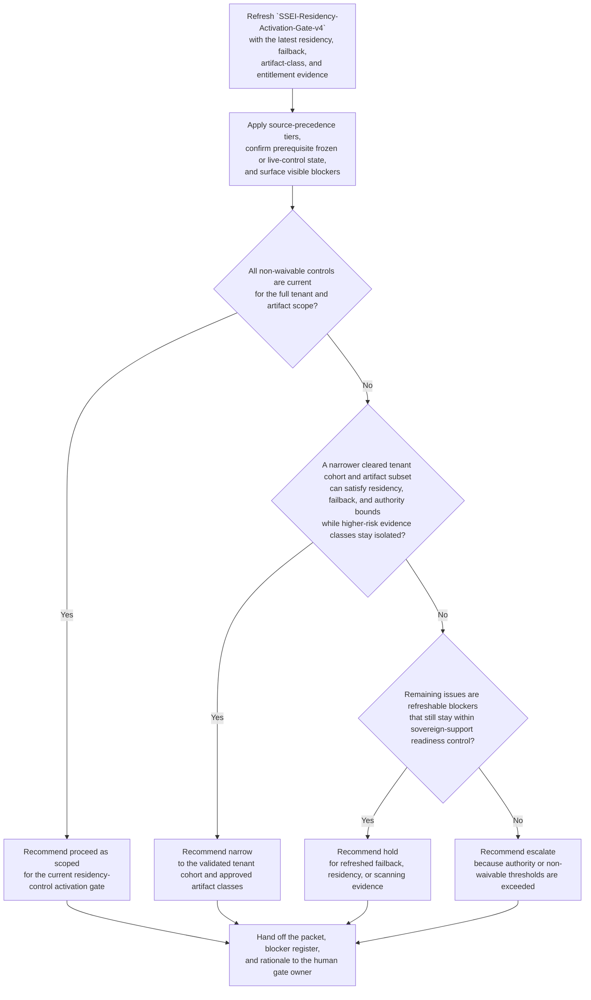
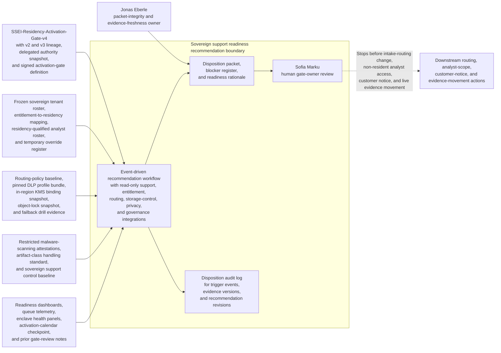

# Sovereign support evidence-intake residency-control activation readiness gate disposition recommendation

## Linked pattern(s)

- `readiness-gate-disposition-recommendation`

## Domain

Support.

## Scenario summary

A sovereign support governance board is re-evaluating whether the governed packet `SSEI-Residency-Activation-Gate-v4` is ready to pass its primary residency-control activation gate before regulated premium-support tenants are moved from a shared-region quarantine intake path to a new in-region evidence-intake enclave. Since the previous packet revision, failback drill evidence for the encrypted crash-dump escrow path has aged beyond the fourteen-day freshness window, the frozen entitlement-to-residency mapping still leaves tenant `atlas-tax-eu` on a temporary non-resident analyst override list, and the newest restricted malware-scanning attestation covers log bundles and screenshots but not encrypted packet-capture archives, although a narrower activation limited to logs, screenshots, and text diagnostics for the fully cleared tenant cohort appears feasible. The workflow must recommend whether support should proceed as scoped, hold for refreshed evidence and blocker closure, narrow the activation to the validated tenant and artifact subset, or escalate because residency-control coverage gaps, failback-readiness uncertainty, or delegated sovereign-support authority thresholds no longer fit local control before any intake-routing change, analyst-scope expansion, customer notice, or live evidence movement occurs. Accountability for packet quality remains with Jonas Eberle, Director of Sovereign Support Platform Readiness, rather than gate approval, routing activation, customer communication, or downstream case handling.

**Prerequisite state that must be confirmed before a disposition can be narrowed or advanced:**
- The in-scope sovereign tenant roster is frozen in `sov-support-tenants-2026-04-17.csv` and matches the entitlement export attached to packet `SSEI-Residency-Activation-Gate-v4`.
- Routing-policy baseline `sovereign-intake-routing-2026-04-15` and DLP profile bundle `support-evidence-dlp-2026-04-14` are pinned to the active review window so later edits cannot silently change the packet basis.
- Current failback drill evidence for the shared-region quarantine path and the in-region intake disable path is present, versioned, and still inside the policy freshness window unless explicitly surfaced as a blocker.
- The residency-qualified analyst roster, in-region KMS binding snapshot, and object-lock configuration snapshot are sealed read-only for the review window.
- Delegated authority snapshot `Sov-Support-Activation-Authority-2026-04-16` is attached and confirms which proceed, hold, narrow, or escalation paths Jonas Eberle may package for the human gate owner.

## Target systems / source systems

**Authoritative (highest precedence):**
- `SSEI-Residency-Activation-Gate-v4`, prior packet revisions `v2` and `v3`, the delegated authority snapshot, and the signed gate definition for the `sovereign support platform activation lane`
- The frozen sovereign tenant roster, entitlement-to-residency mapping export, analyst residency-qualified roster, and temporary override register for in-scope support personnel
- Routing-policy baseline `sovereign-intake-routing-2026-04-15`, the pinned DLP profile bundle, in-region KMS binding snapshot, object-lock configuration snapshot, and failback drill evidence for the named review window
- Restricted malware-scanning attestation set, artifact-class handling standard, and signed sovereign support control baseline governing logs, screenshots, crash dumps, and packet-capture archives

**Operational and contextual (secondary precedence):**
- Sovereign intake readiness dashboards, queue telemetry, enclave health panels, and storage-capacity views used to interpret current packet evidence
- Reviewer annotations from sovereign support operations, privacy engineering, and platform security attached to packet `v3` and the working draft for `v4`
- The activation-calendar checkpoint record and prior gate-review notes that explain why the current packet returned for refresh

**Excluded from authoritative use without explicit promotion:**
- Case bridge summaries, analyst chat, or screenshots that are not linked back to the packet, control baseline, or evidence store
- Verbal assurances that a tenant can "stay on the new path" unless that claim appears in the frozen roster, override register, or signed reviewer annotation
- Draft customer notice text, routing runbooks, or staffing proposals created for downstream activation execution

## Why this instance matters

This instance grounds `readiness-gate-disposition-recommendation` in support through one exact sovereign support platform activation gate packet rather than through incident investigation, contingency activation approval, or recommendation-packet release. The hard problem is not granting access, accepting customer evidence, or deciding a concession. It is refreshing one governed readiness judgment as residency mappings, failback proof, artifact-class controls, and tenant scope shift around a known activation gate. The example is structurally distinct from the support investigation and recommendation-release examples because the core question is whether a new sovereign evidence-intake path is ready to become active for a frozen tenant cohort under explicit residency controls.

## Likely architecture choices

- Event-driven monitoring fits because failback-evidence expiry, entitlement-to-residency mapping changes, malware-scanning attestation updates, and activation-window pressure should trigger a refreshed gate recommendation immediately.
- Human-in-the-loop review is mandatory because the workflow should advise on proceed, hold, narrow, or escalate posture, not approve the activation, broaden analyst scope, notify customers, or move live evidence.
- Read-only integration with entitlement, routing, storage-control, privacy, and governance systems is preferable so the agent cannot silently convert a recommendation packet into an active support-routing change.

## Governance notes

- The workflow should stay centered on one inspectable artifact, `SSEI-Residency-Activation-Gate-v4`, with recommendation lineage preserved back to `SSEI-Residency-Activation-Gate-v2` and `v3`, including accepted and rejected narrowing proposals plus the evidence delta that changed the recommended disposition.
- Source precedence must remain explicit: the signed gate packet, delegated authority snapshot, frozen tenant roster, entitlement-to-residency mapping, residency-qualified analyst roster, routing and DLP baselines, KMS and object-lock snapshots, failback evidence, and restricted malware-scanning attestations outrank bridge notes, queue chat, or unverified operator commentary. Lower-precedence material can contextualize the packet but cannot silently override blockers.
- Prerequisite frozen or live-control state must stay visible in the packet, including the frozen in-scope tenant roster, pinned routing and DLP baselines, sealed analyst residency roster, sealed KMS and object-lock snapshots, and current failback drill evidence for both the legacy quarantine path and the in-region enclave disable path.
- Visible blockers should remain concrete and named, including stale failback evidence for encrypted crash-dump escrow path `escrow-failback-drill-2026-04-01`, unresolved removal of tenant `atlas-tax-eu` from temporary override record `sov-override-118`, incomplete malware-scanning attestation `scan-attest-42` for encrypted packet-capture archives, and pending DLP exception acknowledgment for the `jp-sovereign-tier-a` screenshot path; any narrow recommendation must show exactly which tenants and artifact classes stay out of scope.
- The human decision lane should remain concrete: Sofia Marku, Chair of the Sovereign Support Activation Board, receives the packet for governed disposition review while Jonas Eberle remains the named owner accountable for packet integrity, blocker visibility, and evidence freshness rather than the gate decision itself.
- The boundary must remain clear: the workflow does not approve the gate, change routing, authorize non-resident analyst access, notify customers, transfer evidence, retire the shared-region path, or execute the activation.

## Evaluation considerations

- Reviewer agreement with the recommended proceed, hold, narrow, or escalate disposition before any evidence-intake routing change or analyst-scope expansion is authorized
- Rate at which stale failback proof, unresolved residency overrides, incomplete artifact-class scanning coverage, or DLP acknowledgment gaps are surfaced before the governed activation checkpoint
- Quality of traceability linking source-precedence tiers, prerequisite state, blocker visibility, revision lineage, and named ownership to the disposition recommendation
- Stability of recommendations when tenant mappings, failback evidence, DLP state, or artifact-class attestations change during the final gate window
