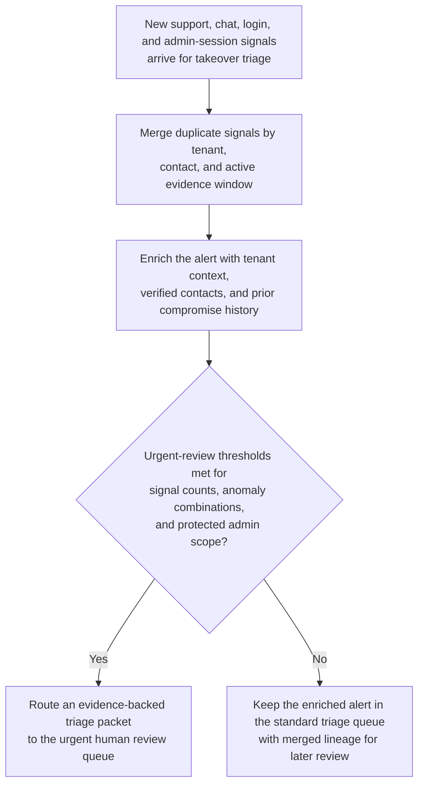

# Suspected account takeover support alert triage

## Linked pattern(s)

- `risk-alert-triage`

## Domain

Support.

## Scenario summary

An enterprise support operations team monitors a live alert stream that combines inbound support tickets, chat transcripts, failed-login spikes, MFA-reset attempts, and anomalous admin-session telemetry to detect possible customer account takeover events before the case queue is overwhelmed. The workflow must merge duplicate signals, attach tenant and entitlement context, and prioritize which alerts need immediate human review. A case should rise to the urgent queue when, for example, a tenant shows at least three administrator lockout tickets within 20 minutes, two or more failed MFA reset attempts from a new country within one hour, or any combination of support contact plus admin-session anomaly that suggests unauthorized access to billing, export, or user-management features. The goal is to package an evidence-backed triage record for a support security lead, not to freeze accounts, promise customer remediation, or send external notifications automatically.

## Target systems / source systems

- Support ticketing and live-chat platform with ticket severity, contact identity, tenant history, and recent escalation notes
- Identity and access telemetry showing failed logins, MFA-reset attempts, privileged-session creation, IP reputation, and geo-velocity anomalies
- CRM and entitlement records with account tier, named administrators, verified support contacts, and prior takeover or compromise history
- Case-management queue used by support security specialists, incident managers, and customer escalation leads
- Audit-grade evidence store preserving triggering signals, merged-alert lineage, routing rationale, and human approval steps

## Why this instance matters

This grounds `risk-alert-triage` in support work where the hard problem is converting noisy, partially trustworthy customer distress signals into a governed response queue before an actual compromise worsens. A naive workflow would either flood specialists with duplicate lockout complaints and harmless travel-related login anomalies or under-rank the one alert cluster that precedes real tenant abuse. The instance keeps the family boundary clear: the agentic work is continuous watching, de-duplication, enrichment, and escalation packaging, while sensitive actions such as account restriction, customer notification, and formal incident declaration remain human-controlled downstream decisions.

## Likely architecture choices

- Event-driven monitoring should continuously score new ticket, chat, and identity events, then reopen or merge alert clusters as additional evidence arrives.
- A tool-using single agent can normalize contact identity, correlate support interactions with tenant login anomalies, attach prior-case context, and publish a prioritized triage packet with explicit threshold hits.
- Human-in-the-loop review should remain mandatory for any alert that could trigger account lockdown, customer-facing compromise language, or escalation into the formal security incident process.
- Approval-gated escalation is a good fit because the workflow can recommend urgent routing to a support security lead or incident manager, but it should not independently suspend access, notify the customer, or mark the tenant as compromised.

## Governance notes

- Evidence packets should show which thresholds fired, which raw events were merged, what contact-verification checks passed or failed, and why the alert entered a given severity band.
- Low-confidence but high-consequence cases should bias toward human review rather than silent suppression, especially when billing admins, export permissions, or tenant-owner credentials are implicated.
- Customer-facing commitments about compromise status, restoration timing, reimbursement, or forensic conclusions must stay under explicit human approval even when the alert score is extreme.
- Sensitive identifiers such as user emails, IP addresses, device fingerprints, and billing metadata should be minimized in broad queue views while remaining traceable in restricted audit artifacts.
- Any workflow transition into account restriction, emergency credential reset, or security-incident declaration should require an accountable support or security owner to approve the move.

## Evaluation considerations

- Recall of historically valid takeover or attempted-compromise cases that should have been routed to urgent human review
- Reduction in duplicate analyst work from merged lockout or chat-driven alert clusters without lowering capture of real compromise signals
- Median time from first relevant signal to a triage packet containing threshold evidence, tenant context, contact-verification status, and routing rationale
- Reviewer override rate for alerts that were under-ranked because identity anomalies looked benign or over-ranked because support noise was not properly deduplicated
- Auditability of suppression, merge, and escalation decisions during post-incident review, customer complaint follow-up, or control testing
